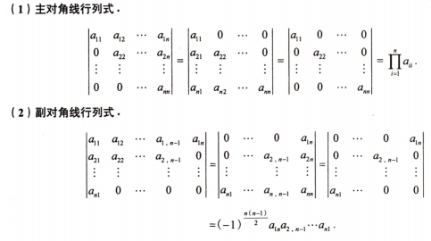

# 第1讲 行列式（第1课）

> [!abstract] 具体型行列式：观察结构，化归基本形
> 元素 $a_{ij}$ 已给出时，先盯住所求目标，再找零元素多、对应位置差别最小、行列和相等或可递推的结构，选择展开、加边、递推或归纳。

## 一、化为基本形行列式：12＋1

**O：** 所给行列式就是基本形或接近基本形。

**P：** 直接套公式，或经简单处理化成基本形后套公式。“12＋1”包括主对角线类 $3$ 种、副对角线类 $3$ 种、分块主对角线类 $3$ 种、分块副对角线类 $3$ 种，以及范德蒙德行列式。

### 1. 主对角线与副对角线

| 结构                 | 计算公式                                                      |
| ------------------ | --------------------------------------------------------- |
| 右上三角、左下三角、**主对角线** | $D=\displaystyle\prod_{i=1}^n a_{ii}$                     |
| 左上三角、右下三角、**副对角线** | $D=(-1)^{n(n-1)/2}\displaystyle\prod_{i=1}^n a_{i,n+1-i}$ |

**D：** 副对角线类可通过逆序排列各列化为主对角线类；需交换 $n(n-1)/2$ 次，因此不能漏掉符号因子。

### 2. 分块行列式：拉普拉斯展开

设 $A$ 为 $m$ 阶方阵，$B$ 为 $n$ 阶方阵，$O$ 为相应大小的零块，$C$ 为相应大小的矩阵块。

分块主对角线类：

$$
\begin{vmatrix}A&O\\O&B\end{vmatrix}
=\begin{vmatrix}A&C\\O&B\end{vmatrix}
=\begin{vmatrix}A&O\\C&B\end{vmatrix}
=|A||B|.
$$

分块副对角线类：

$$
\begin{vmatrix}O&A\\B&O\end{vmatrix}
=\begin{vmatrix}C&A\\B&O\end{vmatrix}
=\begin{vmatrix}O&A\\B&C\end{vmatrix}
=(-1)^{mn}|A||B|.
$$

**D：** $A,B$ 必须是方阵，阶数可不同；副对角线类符号为 $(-1)^{mn}$。各式的 $C$ 仅表示该位置允许出现的任意相容块，不要求各处尺寸相同。

### 3. 范德蒙德行列式

$$
\begin{vmatrix}
1&1&\cdots&1\\
x_1&x_2&\cdots&x_n\\
x_1^2&x_2^2&\cdots&x_n^2\\
\vdots&\vdots&&\vdots\\
x_1^{n-1}&x_2^{n-1}&\cdots&x_n^{n-1}
\end{vmatrix}
=\prod_{1\le i<j\le n}(x_j-x_i),\qquad n\ge2.
$$

**D：** 每列幂次依次为 $0,1,\ldots,n-1$，第2行显露底数。转置后公式不变，此时看第2列；每个因子都按“大下标减小下标”，不能混用顺序。

## 二、观察研究对象：先化出零元素

**O：** 某行或列零元素多；对应位置元素差别最小；或行和、列和相等。

**P：**

1. **零元素多：** 按该行或列展开：
   $$D=\sum_{j=1}^n a_{ij}A_{ij}\quad\text{或}\quad D=\sum_{i=1}^n a_{ij}A_{ij},\qquad A_{ij}=(-1)^{i+j}M_{ij}.$$
2. **对应位置差别最小：** 用行列式性质作倍加等处理，尽可能多地化出零元素，再按该行或列展开。
3. **各行和相等：** 将第2至第 $n$ 列都加到第1列。若公共行和为 $s\ne0$，提出 $s$ 后第1列全为 $1$，再把第1行的负1倍加到其余各行，沿第1列展开。
4. **各列和相等：** 将第2至第 $n$ 行都加到第1行，再作相应的提因子、列倍加和展开。

**D：**

- 两行或两列互换，行列式变号；一行或一列乘 $k$，行列式乘 $k$；一行或一列的 $k$ 倍加到另一行或列，行列式不变。
- 公共和 $s=0$ 时，直接出现零列或零行，故 $D=0$，不能除以 $s$。
- 展开时是“元素 × **代数余子式**”，不是只乘余子式；删去的行、列与符号都要核对。
- 出现零行、零列，或两行、两列成比例，可直接判定行列式为零。

> [!example] 配套例题
> [[AI课程总结/强化篇/线代/第1讲 行列式/例题#例 1.1 行列式方程的不同根个数|例 1.1]] · [[AI课程总结/强化篇/线代/第1讲 行列式/例题#辅助例 1 三阶副对角线类的符号|副对角线符号]]

## 三、含变量行列式与多项式方程

**O：** 具体型行列式含 $x$，要求方程 $f(x)=g(x)$ 的不同根个数。

**P：** 把行列式当作关于 $x$ 的表达式；当各元素是 $x$ 的多项式时，行列式也是多项式。先观察并计算 $f(x),g(x)$，再解普通方程 $f(x)-g(x)=0$。

**D：** 不因带 $x$ 就忽略结构；某个行列式可能恒为零。不同根按不同取值计数，重根只计一次；若题目限制实根，须检查根是否为实数。

> [!example] 配套例题
> [[AI课程总结/强化篇/线代/第1讲 行列式/例题#例 1.1 行列式方程的不同根个数|例 1.1]]

## 四、方程组有解：连接增广行列式与余子式

**O：** 已知非齐次方程组有解，但目标是某个行列式的值，且所求量和已知行列式嵌在增广矩阵中。

**P：**

1. “$Ax=\beta$ 有解”转换为
   $$r(A)=r(A\mid\beta).$$
2. 数清方程个数与未知数个数。若有 $n+1$ 个方程、$n$ 个未知数，则 $r(A)\le n$；有解时 $(n+1)$ 阶增广矩阵不满秩，故
   $$\det(A\mid\beta)=0.$$
3. 对照**所求目标**，检查它是否为增广行列式某个元素的余子式；沿零元素多、能连接目标与已知量的行或列展开。
4. 由展开所得的关系直接求目标，避免先求出所有参数。

**D：**

- 系数矩阵若不是方阵，不能对它直接写行列式。
- 上述“有解 $\Rightarrow$ 增广行列式为零”一般不能反过来用；有解的充要条件始终是秩相等。
- 一个非零的 $n$ 阶子式能给出 $r(A)\ge n$，再结合列数得到 $r(A)=n$。

> [!example] 配套例题
> [[AI课程总结/强化篇/线代/第1讲 行列式/例题#例 1.2 有解条件与两个余子式|例 1.2]]

## 五、加边法与秩一结构

**O：** 一开始不宜使用“互换”“倍乘”“倍加”性质；或各行、列有适合统一消去的公共部分。

**P：** 在 $n$ 阶行列式中添加一行、一列，升至 $n+1$ 阶。把新增第1列取为 $(1,0,\ldots,0)^{\mathrm T}$，新增第1行其余元素可任意选择：

$$
D_n=|A|=\begin{vmatrix}1&u^{\mathrm T}\\0&A\end{vmatrix}.
$$

选择 $u^{\mathrm T}$ 与原式的公共部分相匹配，通过倍加消去原式中的复杂部分，再化为基本形。

对实列向量 $\alpha=(x_1,\ldots,x_n)^{\mathrm T}$，可直接调用：

$$
\boxed{|\alpha\alpha^{\mathrm T}+E|=1+\sum_{i=1}^n x_i^2.}
$$

也可从特征值入手：$\alpha\ne0$ 时，$\alpha\alpha^{\mathrm T}$ 的特征值为 $\sum x_i^2$ 和 $n-1$ 个 $0$；加上 $E$ 后各特征值加 $1$，再取乘积。

**D：**

- 新增 $1$ 在 $(1,1)$ 位置，沿新增第1列展开恰好得到原式，故值不变。
- $\alpha\alpha^{\mathrm T}$ 是 $n\times n$ 矩阵，而 $\alpha^{\mathrm T}\alpha=\sum x_i^2$ 是标量。
- 上述特征值说明依赖实向量的结构；不能只凭“一般矩阵的秩为1”就断言恰有一个非零特征值。
- $\alpha=0$ 时行列式为 $|E|=1$，公式仍成立。

> [!example] 配套例题
> [[AI课程总结/强化篇/线代/第1讲 行列式/例题#例 1.3 加边法与特征值法|例 1.3：三阶结构、一般阶加边与特征值法]]

## 六、递推法：高阶到低阶

**O：** 直接计算 $n$ 阶行列式，结果未给出，且展开后可得到同结构的低阶行列式。

**P：**

1. 选择零元素多、又能保留原式分布规律的行或列展开。
2. 建立 $D_n$ 与 $D_{n-1}$ 的关系；复杂时建立 $D_n,D_{n-1},D_{n-2}$ 的关系。
3. 求初始值 $D_1$，必要时再求 $D_2$。
4. 逐次代入、降低阶数，整理出 $D_n$。

**D：**

- $D_{n-1}$ 必须与 $D_n$ **具有完全相同的元素分布规律，只少一阶**；不是任意 $(n-1)$ 阶余子式都能记为 $D_{n-1}$。
- 同时核对形状、参数的位置与下标。带 $b+a_1$ 的结构应从右下角追踪，不能随意把它删掉。
- 两次展开后若认作 $D_{n-2}$，须确认共删去两行两列，而且剩余结构仍一致。
- 递推方向是高阶到低阶；已代入式子外面的系数和加项不随下一次下标变化而改变。

> [!example] 配套例题
> [[AI课程总结/强化篇/线代/第1讲 行列式/例题#例 1.4 异爪形行列式的递推|例 1.4]]

## 七、数学归纳法：低阶到高阶

**O：** 涉及 $n$ 阶行列式的证明型计算问题，已知计算结果，要求证明。

**P：** 先展开得到相邻阶之间的关系，再用“验—设—证”。

| 所需关系 | 验证 | 假设 | 证明 |
| --- | --- | --- | --- |
| $F(D_n,D_{n-1})=0$ | 初始阶成立，通常验 $n=1$ | 设 $n=k$ 时结果成立 | 用 $D_{k+1}$ 与 $D_k$ 的关系，证 $n=k+1$ 成立 |
| $F(D_n,D_{n-1},D_{n-2})=0$ | 验 $n=1,2$ 均成立 | 设所有 $1\le n<k$ 时结果成立 | $k\ge3$，代入前两阶结果，证 $n=k$ 成立 |

**D：** 归纳假设是可使用的已知条件，必须明确代入；涉及前两阶时不能只验第一阶。不能把尚未证明的当前阶结论直接作为条件使用。

> [!example] 配套例题
> [[AI课程总结/强化篇/线代/第1讲 行列式/例题#例 1.4 异爪形行列式的递推|例 1.4：第一归纳法]] · [[AI课程总结/强化篇/线代/第1讲 行列式/例题#例 1.5 三对角行列式的归纳证明|例 1.5：第二归纳法]]

## 八、考场自查

- [ ] 是否同时看了题干与所求目标，先识别了可直接连接目标的结构？
- [ ] 是否找过零元素多、对应位置差别最小、行列和相等的位置？
- [ ] 副对角线、分块副对角线、展开项的符号是否分别核对？
- [ ] 是否把“有解”的秩条件误当成“行列式为零”的充要条件？
- [ ] 低阶余子式是否仍遵循原式的完整元素分布规律？
- [ ] 递推初始值、归纳验证阶数与参数特殊值是否遗漏？
