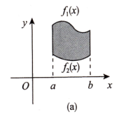
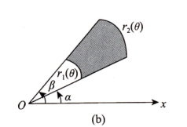
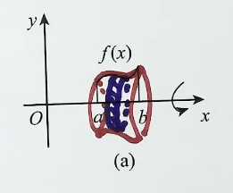
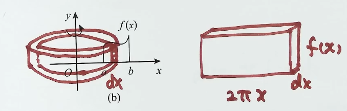
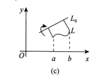
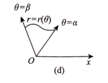

# 第10讲 一元函数积分学的应用（一）（第1课）

> [!abstract] 计算公式：先锁定几何量，再匹配曲线表达形式与旋转轴
> 面积取非负微元，体积辨清旋转轴与截面，平均值用积分除以区间长度；弧长先写 $\mathrm ds$，旋转曲面侧面积再用“圆周长乘弧长微元”。

## 一、方法入口

| O：遇到什么问题 | P：用什么程序 | D：检查什么 |
| --- | --- | --- |
| 计算直角坐标、极坐标或参数方程给出的平面图形面积 | 确定边界与区间，按曲线表达形式选面积公式 | 绝对值、极坐标的 $\frac12$、参数换元中的 $x'(t)$ |
| 曲边梯形绕 $x$ 轴旋转一周的体积 | 用圆盘微元 $\mathrm dV=\pi f^2(x)\,\mathrm dx$ | 半径是到旋转轴的距离；平方不能漏 |
| 曲边梯形绕 $y$ 轴旋转一周的体积，且 $0\le a<b$ | 用柱壳微元 $\mathrm dV=2\pi x\lvert f(x)\rvert\,\mathrm dx$ | $x$ 是半径，$\lvert f(x)\rvert$ 是高度 |
| 平面曲线绕定直线旋转 | 核对垂线交点条件，代入定直线旋转公式 | $A,B,C$、$f'(x)$、分母的 $\frac32$ 次方 |
| 极坐标图形绕极轴旋转 | 核对区域与角度范围，代入极坐标体积公式 | $r^3(\theta)$、$\sin\theta$、系数 $\frac{2\pi}{3}$ |
| 求函数在 $[a,b]$ 上的平均值 | 计算定积分，再除以 $b-a$ | 不加绝对值；$a<b$ |
| 求平面光滑曲线的弧长 | 选对应的弧长微元并积分 | 导数对哪个变量求；曲线是否被重复走过 |
| 求曲线绕 $x$ 轴旋转一周的侧面积 | 写 $\mathrm dS=2\pi\lvert y\rvert\,\mathrm ds$，再代入弧长微元 | 用 $\mathrm ds$；结果是侧面积 |

## 二、平面图形的面积

### 1. 直角坐标系

**O：** 图形由 $y=f_1(x)$、$y=f_2(x)$ 及 $x=a$、$x=b$ 围成，$a<b$。

**P：** 确定积分区间，计算两曲线间的竖直距离并积分：

$$
\boxed{S=\int_a^b\lvert f_1(x)-f_2(x)\rvert\,\mathrm dx}.
$$

**D：** 上下关系确定时可直接写“上减下”；关系发生改变时，在交点处分段去绝对值。几何面积不能让正负部分相互抵消。

### 2. 极坐标系

**O：** 图形在 $\alpha\le\theta\le\beta$ 内由两条径向边界 $r=r_1(\theta)$、$r=r_2(\theta)$ 围成。

**P：** 确定角度区间与内外边界，计算

$$
\boxed{S=\frac12\int_\alpha^\beta
\lvert r_2^2(\theta)-r_1^2(\theta)\rvert\,\mathrm d\theta}.
$$

**D：** 用“外半径的平方减内半径的平方”，不是半径差的平方；系数 $\frac12$ 不能漏。角度区间应覆盖所求区域一次。

### 3. 参数方程

**O：** 曲边梯形的曲边由

$$
\begin{cases}
x=x(t),\\
y=y(t),
\end{cases}
\qquad \alpha\le t\le\beta
$$

给出。

**P：** 将 $y$ 与 $\mathrm dx$ 同时改写为参数形式：

$$
\mathrm dx=x'(t)\,\mathrm dt,
\qquad
\boxed{S=\int_\alpha^\beta\lvert y(t)x'(t)\rvert\,\mathrm dt}.
$$

**D：** 不能只把 $y$ 换成 $y(t)$，却漏掉 $x'(t)$。参数区间应对应所求曲边梯形的一次遍历；若曲线折返，先分清各段对应的区域，避免重复计面积。

> [!attention] 
#注意 上下限是 $t$ 的取值范围
[第2课](AI课程总结/强化篇/高数/第10将%20一元函数积分学的应用（一）/第2课.md#1%20参数换元的通用规则%20易错)
[第2课](AI课程总结/强化篇/高数/第10将%20一元函数积分学的应用（一）/第2课.md#3%20星形线)

## 三、旋转体的体积

### 1. 曲边梯形绕 $x$ 轴：圆盘法

**O：** 曲线 $y=f(x)$、$x=a$、$x=b$（$a<b$）及 $x$ 轴围成的曲边梯形，绕 $x$ 轴旋转一周。

**P：** 圆盘半径为 $\lvert f(x)\rvert$，厚度为 $\mathrm dx$，因此

$$
\mathrm dV=\pi f^2(x)\,\mathrm dx,
\qquad
\boxed{V=\pi\int_a^b f^2(x)\,\mathrm dx}.
$$

**D：** 函数值可能为负，但半径平方始终为 $f^2(x)$。若截面有内孔，应按外圆面积减内圆面积计算，不能把两条边界的函数差直接平方。

### 2. 曲边梯形绕 $y$ 轴：柱壳法

**O：** 曲线 $y=f(x)$、$x=a$、$x=b$（$0\le a<b$）及 $x$ 轴围成的曲边梯形，绕 $y$ 轴旋转一周。

**P：** 柱壳半径为 $x$，高度为 $\lvert f(x)\rvert$，厚度为 $\mathrm dx$，因此

$$
\mathrm dV=2\pi x\lvert f(x)\rvert\,\mathrm dx,
\qquad
\boxed{V=2\pi\int_a^b x\lvert f(x)\rvert\,\mathrm dx}.
$$

**D：** $0\le a<b$ 保证这里的 $x$ 就是非负半径。区域跨越 $y$ 轴时，不能直接把左右两部分的柱壳相加，须先检查旋转后是否重叠。

### 3. 平面曲线绕定直线旋转

**O：** 平面曲线 $L:y=f(x)$，$a\le x\le b$，且 $f(x)$ 可导；定直线

$$
L_0:Ax+By+C=0,\qquad A^2+B^2>0,
$$

并且 **$L_0$ 的任一条垂线与 $L$ 至多有一个交点**。

**P：** 确认 $f(x)$、$f'(x)$、区间与直线系数，计算绕 $L_0$ 旋转一周所得旋转体的体积：

$$
\boxed{
V=\frac{\pi}{(A^2+B^2)^{3/2}}
\int_a^b[Ax+Bf(x)+C]^2
\lvert Af'(x)-B\rvert\,\mathrm dx}.
$$

**D：**

- $A,B,C$ 是直线系数，$a,b$ 是积分端点，不能混淆。
- 平方项中的 $C$ 不能漏；绝对值作用于 $Af'(x)-B$。
- 若一条垂线与曲线有多个交点，应先区分内外边界并处理截面，不能对整条曲线直接套用此式。
- 当 $A=C=0$、$B\ne0$ 时，$L_0$ 为 $x$ 轴，公式化为 $V=\pi\int_a^b f^2(x)\,\mathrm dx$。

### 4. 极坐标图形绕极轴旋转

**O：** 平面图形为

$$
D=\{(r,\theta)\mid 0\le r\le r(\theta),\ 
\theta\in[\alpha,\beta]\subset[0,\pi]\},
$$

绕极轴（$x$ 轴）旋转一周。

**P：** 代入径向边界与角度区间：

$$
\boxed{V=\frac{2\pi}{3}\int_\alpha^\beta
r^3(\theta)\sin\theta\,\mathrm d\theta}.
$$

**D：** 区域从 $r=0$ 延伸到 $r=r(\theta)$，且角度范围在 $[0,\pi]$ 内；不能省掉 $\sin\theta$，也不能将 $r^3$ 写成面积公式中的 $r^2$。

## 四、函数的平均值  #2026/15

**O：** 求连续函数 $f(x)$ 在 $[a,b]$（$a<b$）上的平均值。

**P：** 定积分除以区间长度：

$$
\boxed{\bar f=\frac1{b-a}\int_a^b f(x)\,\mathrm dx}.
$$

**D：**

- 保留 $f(x)$ 的正负，不加绝对值；平均值可以为负。
- 若 $f$ 在 $[a,b]$ 上连续，则由积分中值定理，存在 $\xi\in[a,b]$，使 $\bar f=f(\xi)$。

## 五、平面曲线的弧长（仅数学一、数学二） #必考 

**O：** 求给定平面光滑曲线弧段的长度。

**P：** 按曲线表达形式选用弧长微元，再在相应区间积分：

$$
\mathrm ds=\sqrt{(\mathrm dx)^2+(\mathrm dy)^2}.
$$

| 曲线表达形式                                  | 弧长微元                                                              | **弧长公式**                                                                               |
| --------------------------------------- | ----------------------------------------------------------------- | -------------------------------------------------------------------------------------- |
| $y=y(x)$，$a\le x\le b$                  | $\mathrm ds=\sqrt{1+[y'(x)]^2}\,\mathrm dx$                       | $s=\displaystyle\int_a^b\sqrt{1+[y'(x)]^2}\,\mathrm dx$                                |
| $r=r(\theta)$，$\alpha\le\theta\le\beta$ | $\mathrm ds=\sqrt{[r(\theta)]^2+[r'(\theta)]^2}\,\mathrm d\theta$ | $s=\displaystyle\int_\alpha^\beta\sqrt{[r(\theta)]^2+[r'(\theta)]^2}\,\mathrm d\theta$ |
| $x=x(t),\ y=y(t)$，$\alpha\le t\le\beta$ | $\mathrm ds=\sqrt{[x'(t)]^2+[y'(t)]^2}\,\mathrm dt$               | $s=\displaystyle\int_\alpha^\beta\sqrt{[x'(t)]^2+[y'(t)]^2}\,\mathrm dt$               |

**D：** $y'(x)$ 对 $x$ 求导，$r'(\theta)$ 对 $\theta$ 求导，$x'(t),y'(t)$ 对 $t$ 求导。极坐标弧长含 $r^2+(r')^2$，不能套成 $1+(r')^2$；参数区间应使所求弧段被遍历一次。

## 六、旋转曲面的面积（侧面积，仅数学一、数学二）

**O：** 曲线弧段绕 $x$ 轴旋转一周，求所得旋转曲面的面积。

**P：** 先写旋转半径，再乘弧长微元：

$$
\boxed{\mathrm dS=2\pi\lvert y\rvert\,\mathrm ds}.
$$

| 曲线表达形式与条件                                             | 旋转半径                               | **侧面积公式**                                                                                                                  |
| ----------------------------------------------------- | ---------------------------------- | -------------------------------------------------------------------------------------------------------------------------- |
| $y=y(x)$，$x\in[a,b]$                                  | $\lvert y(x)\rvert$                | $S=2\pi\displaystyle\int_a^b\lvert y(x)\rvert\sqrt{1+[y'(x)]^2}\,\mathrm dx$                                               |
| $r=r(\theta)$，$\theta\in[\alpha,\beta]\subset[0,\pi]$ | $\lvert r(\theta)\sin\theta\rvert$ | $S=2\pi\displaystyle\int_\alpha^\beta\lvert r(\theta)\sin\theta\rvert\sqrt{[r(\theta)]^2+[r'(\theta)]^2}\,\mathrm d\theta$ |
| $x=x(t),\ y=y(t)$，$t\in[\alpha,\beta]$，$x'(t)\ne0$    | $\lvert y(t)\rvert$                | $S=2\pi\displaystyle\int_\alpha^\beta\lvert y(t)\rvert\sqrt{[x'(t)]^2+[y'(t)]^2}\,\mathrm dt$                              |

**D：**

- 侧面积微元用 $\mathrm ds$，不能直接用水平投影 $\mathrm dx$ 代替。
- 极坐标下，到 $x$ 轴的距离是 $\lvert r(\theta)\sin\theta\rvert$，不是 $r(\theta)$。
- 上述公式计算曲线旋转产生的侧面积；若求封闭旋转体的总表面积，还需按题意计算端面。

## 七、公式自查

- [ ] 面积公式是否取了非负微元，极坐标面积是否保留 $\frac12$？
- [ ] 参数方程求面积时，是否同步替换了 $y$、$\mathrm dx$ 与上下限？
- [ ] 旋转体是否辨清了轴、半径、截面有无内孔以及旋转后的重叠？
- [ ] 定直线旋转是否满足垂线至多一个交点的条件，且保留了 $C$ 与导数项？
- [ ] 平均值是否除以 $b-a$，并保留函数的正负？
- [ ] 弧长和侧面积是否使用正确的 $\mathrm ds$，侧面积半径是否为到旋转轴的距离？
