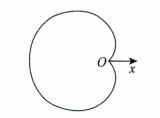

# 第10讲 一元函数积分学的应用（一）（第2课）

> [!abstract] 基本图形：表达式识图 → 选公式 → 定范围 → 做计算
> 面积、弧长可利用图形对称性；旋转体积还要辨清旋转轴和重叠，不能照搬面积的倍数。

## 一、方法入口

| O：遇到什么问题 | P：用什么程序 | D：检查什么 |
| --- | --- | --- |
| 心形线 $r=a(1\pm\cos\theta)$ 或 $r=a(1\pm\sin\theta)$ 的几何量 | 识别方向，面积与弧长利用对称性；绕极轴体积取适当区域 | 四种方向的面积、弧长相同，不代表绕同一轴的体积都相同 |
| 螺线在指定角度区间内所围面积 | 在指定区间积分 $\frac12r^2(\theta)$ | 求的是局部区域，不是整条螺线 |
| 三叶、四叶玫瑰线所围面积 | 先求一叶面积，再乘叶数 | 一叶的起止角；不能重复描图、重复计面积 |
| 摆线一拱的弧长、面积、绕 $x$ 轴体积 | 一拱取 $0\le t\le2\pi$，用参数公式 | $x,y$ 的表达式不能互换；面积、体积都要保留 $x'(t)$ |
| 星形线的弧长、面积、绕 $x$ 轴体积 | 用参数式，弧长与面积算第一象限后乘 $4$ | 第一象限内 $x$ 随 $t$ 增大而减小；体积不能乘 $4$ |
| 笛卡儿叶形线所围面积及渐近线 | 面积转极坐标；渐近线用参数式求极限 | 闭环在第一象限；$x\to\pm\infty$ 对应 $t\to-1$，不是 $t\to\pm\infty$ |

## 二、基本图形与几何量速查

以下均设 $a>0$；$S$ 表示面积，$V$ 表示旋转体积，$s$ 表示弧长。弧长仅数学一、数学二。

### 1. 心形线、摆线、星形线

| 图形                                         | 表达式                                                                   | 所求范围                     | 面积 $S$                | 体积 $V$                          | 弧长 $s$ |
| ------------------------------------------ | --------------------------------------------------------------------- | ------------------------ | --------------------- | ------------------------------- | ------ |
|  | 心形线 $r=a(1-\cos\theta)$                                               | 完整图形，$0\le\theta\le2\pi$ | $\frac32\pi a^2$      | $\frac83\pi a^3$（绕极轴）           | $8a$   |
| ![[ch10-l2-heart-plus-cos.png\|140]]       | 心形线 $r=a(1+\cos\theta)$                                               | 完整图形，$0\le\theta\le2\pi$ | $\frac32\pi a^2$      | $\frac83\pi a^3$（绕极轴）           | $8a$   |
| ![[ch10-l2-heart-minus-sin.png\|140]]      | 心形线 $r=a(1-\sin\theta)$                                               | 完整图形，$0\le\theta\le2\pi$ | $\frac32\pi a^2$      | —                               | $8a$   |
| ![[ch10-l2-heart-plus-sin.png\|140]]       | 心形线 $r=a(1+\sin\theta)$                                               | 完整图形，$0\le\theta\le2\pi$ | $\frac32\pi a^2$      | —                               | $8a$   |
| ![[ch10-l2-cycloid.png\|140]]              | 摆线 $x=a(t-\sin t),\ y=a(1-\cos t)$                                    | **一拱**，$0\le t\le2\pi$   | $3\pi a^2$（与 $x$ 轴所围） | $5\pi^2a^3$（绕 $x$ 轴）            | $8a$   |
| ![[ch10-l2-astroid.png\|140]]              | 星形线 $x=a\cos^3t,\ y=a\sin^3t$，或 $x^{\frac23}+y^{\frac23}=a^{\frac23}$ | 完整图形，$0\le t\le2\pi$     | $\frac38\pi a^2$      | $\frac{32\pi}{105}a^3$（绕 $x$ 轴） | $6a$   |

**识图要点：**

- 心形线的尖点均在原点：$1-\cos\theta$ 主体向左，$1+\cos\theta$ 主体向右；$1-\sin\theta$ 主体向下，$1+\sin\theta$ 主体向上。
- 摆线一拱的两端为 $(0,0)$、$(2\pi a,0)$，最高点为 $(\pi a,2a)$。交换 $x,y$ 后，图形关于 $y=x$ 对称，围成区域与旋转轴的关系也随之改变。
- 星形线关于两坐标轴对称，与坐标轴交于 $(\pm a,0)$、$(0,\pm a)$；第一象限弧对应 $0\le t\le\frac\pi2$。

### 2. 双纽线、玫瑰线

| 图形                                   | 表达式                         | 识图要点                                              | 完整图形面积 $S$       | 旋转体积 $V$                            |
| ------------------------------------ | --------------------------- | ------------------------------------------------- | ---------------- | ----------------------------------- |
| ![[ch10-l2-lemniscate-cos.png\|140]] | 伯努利双纽线 $r^2=a^2\cos2\theta$ | 两叶沿 $x$ 轴，径向端点为 $(\pm a,0)$                       | $a^2$            | $\frac{\sqrt2}{8}\pi^2a^3$（绕 $y$ 轴） |
| ![[ch10-l2-lemniscate-sin.png\|140]] | 伯努利双纽线 $r^2=a^2\sin2\theta$ | 两叶沿 $\theta=\frac\pi4$ 与 $\theta=\frac{5\pi}4$ 方向 | $a^2$            | $\frac{\pi^2}{4}a^3$（绕极轴）           |
| ![[ch10-l2-rose-three-sin.png\|140]] | 三叶玫瑰线 $r=a\sin3\theta$      | 叶片中心方向为 $\frac\pi6,\frac{5\pi}6,\frac{3\pi}2$     | $\frac14\pi a^2$ | —                                   |
| ![[ch10-l2-rose-three-cos.png\|140]] | 三叶玫瑰线 $r=a\cos3\theta$      | 叶片中心方向为 $0,\frac{2\pi}3,\frac{4\pi}3$             | $\frac14\pi a^2$ | —                                   |
| ![[ch10-l2-rose-four-sin.png\|140]]  | 四叶玫瑰线 $r=a\sin2\theta$      | 四叶沿两条角平分线方向                                       | $\frac12\pi a^2$ | —                                   |
| ![[ch10-l2-rose-four-cos.png\|140]]  | 四叶玫瑰线 $r=a\cos2\theta$      | 四叶沿两坐标轴方向                                         | $\frac12\pi a^2$ | —                                   |

**D：** 双纽线须在右端非负的角度区间内取实数 $r$；每叶面积为 $\frac12a^2$。图形旋转后面积不变，但绕固定轴的体积可能改变。

### 3. 螺线、笛卡儿叶形线

| 图形                                      | 表达式                             | 所求范围                              | 面积 $S$                              | 弧长 $s$                              |
| --------------------------------------- | ------------------------------- | --------------------------------- | ----------------------------------- | ----------------------------------- |
| ![[ch10-l2-spiral-archimedes.png\|140]] | 阿基米德螺线 $r=a\theta$，$\theta\ge0$ | $0\le\theta\le2\pi$ 的弧段与极轴所围      | $\frac43a^2\pi^3$                   | —                                   |
| ![[ch10-l2-spiral-log.png\|140]]        | 对数螺线 $r=e^{a\theta}$            | $0\le\theta\le2\pi$ 的弧段与极轴所围      | $\frac1{4a}(e^{4a\pi}-1)$           | $\frac{\sqrt{1+a^2}}a(e^{2a\pi}-1)$ |
| ![[ch10-l2-spiral-hyperbolic.png\|140]] | 双曲螺线 $r\theta=a$                | $1\le\theta\le\sqrt3$ 的弧段与两端径向线所围 | $\frac{a^2}{2}(1-\frac{\sqrt3}{3})$ | —                                   |
| ![[ch10-l2-folium.png\|140]]            | 笛卡儿叶形线 $x^3+y^3-3axy=0$         | 第一象限闭环                            | $\frac32a^2$                        | —                                   |

笛卡儿叶形线的参数式及斜渐近线：

$$
\begin{cases}
x=\dfrac{3at}{1+t^3},\\
y=\dfrac{3at^2}{1+t^3},
\end{cases}
\qquad t\ne-1;\qquad
\boxed{x+y+a=0}.
$$

## 三、极坐标图形：先定区间，再用对称性

### 1. 面积与弧长

**O：** 曲线以 $r=r(\theta)$ 给出，求所围面积或指定弧段长度。

**P：**

1. 由表达式识图，确定区域边界与角度范围。
2. 图形对称时，选半个图形或一叶，写明相应倍数。
3. 分别代入面积、弧长公式，再化简计算：

$$
S=\frac12\int_\alpha^\beta r^2(\theta)\,\mathrm d\theta,
\qquad
s=\int_\alpha^\beta\sqrt{r^2(\theta)+[r'(\theta)]^2}\,\mathrm d\theta.
$$

| 表达式 | 可选基本区间 | 面积的对称倍数 |
| --- | --- | --- |
| $r=a(1\pm\cos\theta)$ | 上半图形 $0\le\theta\le\pi$ | $2$ |
| $r=a\sin3\theta$ | 一叶 $0\le\theta\le\frac\pi3$ | $3$ |
| $r=a\cos3\theta$ | 一叶 $-\frac\pi6\le\theta\le\frac\pi6$ | $3$ |
| $r=a\sin2\theta$ | 一叶 $0\le\theta\le\frac\pi2$ | $4$ |
| $r=a\cos2\theta$ | 一叶 $-\frac\pi4\le\theta\le\frac\pi4$ | $4$ |

**D：**

- 一叶的起止角由 $r=0$ 确定，且中间应完整遍历该叶。
- 三叶玫瑰线在 $0\le\theta\le2\pi$ 会被重复描绘；不能直接用 $\frac12\int_0^{2\pi}r^2\,\mathrm d\theta$ 作为完整图形面积。
- 螺线按指定区间计算，不任意乘对称倍数；更换角度范围后，不能照用速查表的数值。

### 2. 心形线绕极轴的体积

**O：** $r=a(1\pm\cos\theta)$ 所围图形绕极轴旋转一周。

**P：** 取上半区域 $0\le\theta\le\pi$，用

$$
V=\frac{2\pi}{3}\int_0^\pi r^3(\theta)\sin\theta\,\mathrm d\theta.
$$

代入 $r(\theta)$ 后，令 $u=\cos\theta$ 或 $u=1\pm\cos\theta$，化为多项式积分。

**D：** 上半区域旋转已经得到整个旋转体，不再乘 $2$；不能把 $[0,2\pi]$ 直接代入含 $\sin\theta$ 的体积公式。

### 3. 三角计算的常用入口

| 计算结构 | 处理方法 | 细节 |
| --- | --- | --- |
| 根号内出现 $2-2\cos\theta$ 或 $2+2\cos\theta$ | 用半角公式去根号 | $\sqrt{u^2}=\lvert u\rvert$，再按角度范围判断符号 |
| 出现 $(1\pm\cos\theta)^2$ | 化为半角的四次幂，令 $t=\frac\theta2$ | 同步改变微分与上下限 |
| 出现 $\sin^23\theta$、$\cos^23\theta$ | 令 $t=3\theta$，再用对称性或华里士公式 | $\mathrm d\theta=\frac13\mathrm dt$ |
| 出现 $r^3(\theta)\sin\theta$，且 $r=a(1\pm\cos\theta)$ | 凑 $\mathrm d(\cos\theta)=-\sin\theta\,\mathrm d\theta$ | 负号与上下限同时核对 |

$$
1-\cos\theta=2\sin^2\frac\theta2,
\qquad
1+\cos\theta=2\cos^2\frac\theta2.
$$

## 四、参数图形：面积换元必须保留方向

### 1. 参数换元的通用规则 #易错 

**O：** $x=x(t),\ y=y(t)$ 在所取弧段上决定 $y=f(x)$，需要计算 $\int_a^bf(x)\,\mathrm dx$。

**P：** 同步替换函数、微分与上下限：

$$
f(x(t))=y(t),\qquad \mathrm dx=x'(t)\,\mathrm dt,
$$

$$
\boxed{\int_a^bf(x)\,\mathrm dx
=\int_\alpha^\beta y(t)x'(t)\,\mathrm dt},
\qquad x(\alpha)=a,\quad x(\beta)=b.
$$

**D：**

- $y(t)=f(x(t))$ 是复合函数关系，不是把 $f$ 与 $y$ 当成同一个函数。
- 上下限按 $x$ 的端点对应，不能因为参数区间习惯写成“从小到大”就擅自调换。
- $x$ 在所取弧段应单调；有转向时，先分段。
- 面积非负，但换元中的 $x'(t)$ 有符号；若反转积分上下限，必须同时改变符号。

### 2. 摆线一拱

**O：** $x=a(t-\sin t),\ y=a(1-\cos t)$，求一拱的几何量。

**P：** 取 $0\le t\le2\pi$，先计算

$$
x'(t)=a(1-\cos t),\qquad y'(t)=a\sin t.
$$

| 几何量 | 参数积分 |
| --- | --- |
| 一拱弧长 | $s=\displaystyle\int_0^{2\pi}\sqrt{[x'(t)]^2+[y'(t)]^2}\,\mathrm dt$ |
| 一拱与 $x$ 轴所围面积 | $S=\displaystyle\int_0^{2\pi}y(t)x'(t)\,\mathrm dt$ |
| 绕 $x$ 轴旋转体积 | $V=\pi\displaystyle\int_0^{2\pi}y^2(t)x'(t)\,\mathrm dt$ |

**D：** $x'(t)\ge0$，$x$ 从 $0$ 增至 $2\pi a$；弧长化简时 $\sin\frac t2\ge0$。面积的被积式含 $(1-\cos t)^2$，体积的被积式含 $(1-\cos t)^3$。

### 3. 星形线

**O：** $x^{\frac23}+y^{\frac23}=a^{\frac23}$，求完整曲线的几何量。

**P：** 用 $x=a\cos^3t,\ y=a\sin^3t$，取第一象限弧 $0\le t\le\frac\pi2$：

$$
x'(t)=-3a\cos^2t\sin t,\qquad
y'(t)=3a\sin^2t\cos t.
$$

| 几何量 | 对称性与参数方向 |
| --- | --- |
| 完整弧长 | $s=4\displaystyle\int_0^{\pi/2}\sqrt{[x'(t)]^2+[y'(t)]^2}\,\mathrm dt$ |
| 完整面积 | $S=4\displaystyle\int_0^a y(x)\,\mathrm dx=4\displaystyle\int_{\pi/2}^0y(t)x'(t)\,\mathrm dt$ |
| 绕 $x$ 轴旋转体积 | $V=2\pi\displaystyle\int_0^a y^2(x)\,\mathrm dx=2\pi\displaystyle\int_{\pi/2}^0y^2(t)x'(t)\,\mathrm dt$ |

**D：**

- 在第一象限，$x=0$ 对应 $t=\frac\pi2$，$x=a$ 对应 $t=0$；$x'(t)<0$（内部），与反向上下限配合后面积为正。
- 若改用 $0\to\frac\pi2$ 的参数积分，应将 $x'(t)$ 改为 $-x'(t)$。
- 面积、弧长乘 $4$；体积只把 $x\ge0$ 的部分乘 $2$。上下两半绕 $x$ 轴旋转后重合，不能再重复相加。

## 五、笛卡儿叶形线：面积转极坐标，渐近线转参数极限

### 1. 第一象限闭环面积

**O：** $x^3+y^3-3axy=0$，求其所围闭环面积。

**P：**

1. 令 $x=r\cos\theta,\ y=r\sin\theta$，取得闭环的径向边界：

   $$
   r=\frac{3a\sin\theta\cos\theta}{\sin^3\theta+\cos^3\theta},
   \qquad 0\le\theta\le\frac\pi2.
   $$

2. 写 $S=\frac12\int_0^{\pi/2}r^2(\theta)\,\mathrm d\theta$。
3. 分母提出 $\cos^6\theta$，配出 $\sec^2\theta\,\mathrm d\theta$；令 $u=\tan\theta$，再凑 $\mathrm d(1+u^3)$：

   $$
   S=\frac{9a^2}{2}\int_0^{+\infty}\frac{u^2}{(1+u^3)^2}\,\mathrm du.
   $$

**D：** 闭环只在第一象限，无须乘 $4$；$\theta\to\frac\pi2^-$ 对应 $u\to+\infty$，换元后按反常积分处理。

### 2. 斜渐近线

**O：** 参数曲线在 $x\to\pm\infty$ 时求斜渐近线 $y=kx+b$。

**P：**

1. 从 $x=x(t)$ 判断参数的趋向，而非直接令 $t\to\infty$。
2. 求斜率与截距：

   $$
   k=\lim_{x\to\pm\infty}\frac yx,
   \qquad b=\lim_{x\to\pm\infty}(y-kx).
   $$

3. 对 $x=\frac{3at}{1+t^3},\ y=\frac{3at^2}{1+t^3}$，采用对应关系

   $$
   x\to+\infty\Longleftrightarrow t\to-1^-;
   \qquad x\to-\infty\Longleftrightarrow t\to-1^+.
   $$

   两侧均得 $k=-1,\ b=-a$，故渐近线为 $y=-x-a$。

**D：**

- 化简 $y/x=t$ 后仍须取极限，不能把变量 $t$ 直接当作斜率。
- 求 $b$ 时是 $y-kx=y+x$；可用 $1+t^3=(1+t)(t^2-t+1)$ 约去公因子，或对 $0/0$ 型使用洛必达法则。
- $a>0$ 是长度参数，渐近线在两坐标轴上的截距均为 $-a$，不是 $a$。

## 六、自查

- [ ] 是否由表达式认对图形方向，尤其是心形线的正负号、摆线的 $x,y$？
- [ ] 是否确定了完整图形、一叶、一拱或指定螺线弧段的范围？
- [ ] 极坐标面积是否保留 $\frac12$，且没有重复描图计数？
- [ ] 参数积分是否同时换了 $y$、$\mathrm dx$、上下限，并核对方向？
- [ ] 旋转体是否注明旋转轴，且没有重复计算旋转后的重合部分？
- [ ] 根号去平方时是否检查符号，渐近线是否先确定参数趋向？
