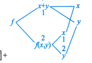

# 第13讲 多元函数微分学（例题）

> [!info] 对应知识点
> [[AI课程总结/强化篇/高数/第13讲 多元函数微分学/第1课|第1课知识点]]
> [[AI课程总结/强化篇/高数/第13讲 多元函数微分学/第4课|第4课知识点]]
> [[AI课程总结/强化篇/高数/第13讲 多元函数微分学/第5课|第5课知识点]]

## 第1课

### 一、辅助理解

#### 辅助例 1 整体换元的趋向

当 $(x,y)\to(0,0)$ 时，考虑 $e^{x^2+y^2}-1$。令 $t=x^2+y^2$，则 $t\to0^+$，因而

$$
e^{x^2+y^2}-1=e^t-1\sim t=x^2+y^2.
$$

**要点：** 整体换元后，先确认新变量趋于何处以及是否为单侧趋近。

#### 辅助例 2 分母变阶的路径

分母若含 $x+y$，在 $y=kx$ 上是 $(1+k)x$；令 $y=-x+x^3$，则分母变为 $x^3$。同样，令 $y=-x+\sqrt{x}$（$x>0$），则分母变为 $\sqrt{x}$。

**要点：** 路径可以使分母升阶或降阶；选哪种扰动，要看与分子代入后的阶数比较。

### 二、课程例题

#### 例 13.1 同阶路径判不存在

**题目：** 求

$$
\lim_{(x,y)\to(0,0)}\frac{x^2-y^2}{x^2+y^2}.
$$

**解：** 分子、分母同为二次式，取 $y=kx$，其中 $x\ne0$：

$$
\frac{x^2-y^2}{x^2+y^2}
=\frac{x^2-k^2x^2}{x^2+k^2x^2}
=\frac{1-k^2}{1+k^2}.
$$

该值随 $k$ 改变，例如 $k=0$ 时为 $1$，$k=1$ 时为 $0$。

**答案：** 二重极限不存在。

#### 例 13.2 变阶路径判不存在

**题目：** 求

$$
\lim_{(x,y)\to(0,0)}\frac{x^3+y^3}{x^2+y}.
$$

**解：** 先取 $y=x$：

$$
\lim_{x\to0}\frac{2x^3}{x^2+x}=0.
$$

分母中的 $x^2+y$ 可被抵消，于是取 $y=-x^2+x^3$。当 $x\ne0$ 时，分母为 $x^3$，从而

$$
\lim_{x\to0}\frac{x^3+(-x^2+x^3)^3}{x^3}
=\lim_{x\to0}\left[1+x^3(x-1)^3\right]=1.
$$

**答案：** 两条路径分别得到 $0$ 与 $1$，二重极限不存在。

#### 例 13.3 配方放缩计算二重极限

**题目：** 求

$$
\lim_{\substack{x\to+\infty\\y\to+\infty}}\frac{x+y}{x^2-xy+y^2}.
$$

**解：** 先将分子拆成 $x$ 项与 $y$ 项。为了让各项的上界只保留其分子中的变量，同一个分母分别按 $y$ 和按 $x$ 配方：

$$
x^2-xy+y^2
=\left(y-\frac{x}{2}\right)^2+\frac34x^2
=\left(x-\frac{y}{2}\right)^2+\frac34y^2.
$$

第一种写法给出 $x^2-xy+y^2\ge\frac34x^2$，用于估计含 $x$ 的项；第二种写法给出 $x^2-xy+y^2\ge\frac34y^2$，用于估计含 $y$ 的项。因此当 $x,y>0$ 时，

$$
\begin{aligned}
0\le\left|\frac{x+y}{x^2-xy+y^2}\right|
&\le\frac{|x|}{x^2-xy+y^2}+\frac{|y|}{x^2-xy+y^2}\\
&\le\frac43\left(\frac1{|x|}+\frac1{|y|}\right)\longrightarrow0.
\end{aligned}
$$

**答案：** 极限为 $0$。两次配方分别去掉各项上界中的另一个变量；最后的上界对所有趋近路径都趋于 $0$。

#### 例 13.4 分项计算二重极限

**题目：** 求

$$
\lim_{\substack{x\to+\infty\\y\to1}}(x^2+y^2)e^{-(x+y)}.
$$

**解：** 分项：

$$
(x^2+y^2)e^{-(x+y)}
=\left(\frac{x^2}{e^x}\right)e^{-y}
+e^{-x}\left(\frac{y^2}{e^y}\right).
$$

当 $x\to+\infty$ 时，$x^2/e^x\to0$ 且 $e^{-x}\to0$；当 $y\to1$ 时，$e^{-y}$ 与 $y^2/e^y$ 都趋于有限值。因此两项均趋于 $0$。

**答案：** 极限为 $0$。

#### 例 13.5 二重极限与累次极限分别判断

**题目：** 设

$$
f(x,y)=\frac{xy}{x^2+y^2},\qquad
I_1=\lim_{\substack{x\to0\\y\to0}}f(x,y),\qquad
I_2=\lim_{y\to0}\left[\lim_{x\to0}f(x,y)\right].
$$

判断 $I_1,I_2$ 是否存在。

**解：** 对 $I_1$ 取 $y=kx$：

$$
\frac{xy}{x^2+y^2}=\frac{k}{1+k^2},
$$

结果随 $k$ 而变，所以 $I_1$ 不存在。对 $I_2$，先固定 $y\ne0$，此时

$$
\lim_{x\to0}\frac{xy}{x^2+y^2}=0,
\qquad
I_2=\lim_{y\to0}0=0.
$$

**答案：** $I_1$ 不存在，$I_2$ 存在且等于 $0$；选 **C**。

#### 例 13.6 交换次序判二重极限

**题目：** 设

$$
f(x,y)=\frac{x^2-y^2}{x^2+y^2},\qquad
I_1=\lim_{x\to0}\left[\lim_{y\to0}f(x,y)\right],\qquad
I_2=\lim_{y\to0}\left[\lim_{x\to0}f(x,y)\right],
$$

$$
I_3=\lim_{\substack{x\to0\\y\to0}}f(x,y).
$$

判断 $I_1,I_2,I_3$ 是否存在。

**解：** 固定 $x\ne0$，先令 $y\to0$，得内层极限为 $1$，故 $I_1=1$。固定 $y\ne0$，先令 $x\to0$，得内层极限为 $-1$，故 $I_2=-1$。两种累次极限均存在但不相等，因而二重极限 $I_3$ 不存在。

**答案：** $I_1,I_2$ 存在，$I_3$ 不存在；选 **A**。

## 第2课

> [!info] 对应知识点
> [[AI课程总结/强化篇/高数/第13讲 多元函数微分学/第2课|第2课知识点]]

### 课程例题

#### 例 13.7 两个单变量方向连续但二元不连续

**题目：** 设

$$
f(x,y)=\begin{cases}1,&xy=0,\\0,&\text{其他},\end{cases}
$$

判断 $f$ 在 $(0,0)$ 处关于两个变量是否分别连续，以及在 $(0,0)$ 是否连续。

**解：** $f(0,0)=1$。在 $x$ 轴和 $y$ 轴上，函数值均为 $1$，故

$$
\lim_{x\to0}f(x,0)=1=f(0,0),\qquad
\lim_{y\to0}f(0,y)=1=f(0,0).
$$

但沿 $y=x$ 且 $x\ne0$ 趋近原点时，$f(x,x)=0$；沿坐标轴趋近时，值为 $1$。二重极限不存在。

**答案：** 关于两个变量分别连续，在原点不连续；选 **B**。这说明单变量连续不能推出二元连续。

#### 例 13.8 不连续但两个偏导数存在

**题目：** 设

$$
f(x,y)=\begin{cases}\dfrac{xy}{x^2+y^2},&(x,y)\ne(0,0),\\0,&(x,y)=(0,0),\end{cases}
$$

判断 $f$ 在 $(0,0)$ 处是否连续、偏导数是否存在。

**解：** 沿 $y=kx$ 趋近原点，

$$
f(x,kx)=\frac{k}{1+k^2},
$$

结果随 $k$ 改变，所以二重极限不存在，$f$ 在原点不连续。又因为 $f(x,0)=f(0,y)=f(0,0)=0$，所以

$$
f'_x(0,0)=\lim_{h\to0}\frac{f(h,0)-f(0,0)}h=0,\qquad
f'_y(0,0)=\lim_{h\to0}\frac{f(0,h)-f(0,0)}h=0.
$$

**答案：** 不连续，两个偏导数均存在；选 **C**。由不连续还可知该点不可微。

#### 例 13.9 连续但偏导数不存在

**题目：** 设 $g(x,y)=\sqrt{x^2+y^2}$，判断 $g$ 在 $(0,0)$ 处是否连续、偏导数是否存在。

**解：** 令 $\rho=\sqrt{x^2+y^2}$，则 $(x,y)\to(0,0)$ 时 $g(x,y)=\rho\to0=g(0,0)$，故连续。但

$$
g'_x(0,0)=\lim_{h\to0}\frac{g(h,0)-g(0,0)}h
=\lim_{h\to0}\frac{\lvert h\rvert}{h}
$$

左右极限分别为 $-1$、$1$，所以 $g'_x(0,0)$ 不存在。同理 $g'_y(0,0)$ 不存在。

**答案：** 连续，两个偏导数均不存在；选 **B**。几何上，$z=\sqrt{x^2+y^2}$ 的原点是圆锥尖点。

## 第3课

> [!info] 对应知识点
> [[AI课程总结/强化篇/高数/第13讲 多元函数微分学/第3课|第3课知识点]]

### 课程例题

#### 例 13.10 连续但不可微

**题目：** 设

$$
f(x,y)=\begin{cases}
\dfrac{x^2y}{x^2+y^2},&(x,y)\ne(0,0),\\
0,&(x,y)=(0,0).
\end{cases}
$$

判断 $f$ 在 $(0,0)$ 是否连续、可微。

**解：** 因为

$$
\lvert f(x,y)\rvert
=\frac{x^2}{x^2+y^2}\lvert y\rvert
\le\lvert y\rvert\longrightarrow0=f(0,0),
$$

故在原点连续。又 $f(x,0)=f(0,y)=0$，由定义得 $f'_x(0,0)=f'_y(0,0)=0$，候选线性增量为 $0$。令 $\Delta y=\Delta x=t\ne0$，$\rho=\sqrt2\lvert t\rvert$，则

$$
\frac{\Delta z}{\rho}
=\frac{t^2t}{(t^2+t^2)\sqrt{t^2+t^2}}
=\frac{t}{2\sqrt2\lvert t\rvert}.
$$

从 $t\to0^+$ 与 $t\to0^-$ 分别得到 $\frac1{2\sqrt2}$ 和 $-\frac1{2\sqrt2}$，余项除以 $\rho$ 不趋于 $0$。

**答案：** 在原点连续、不可微；选 **B**。

#### 例 13.11 偏导函数邻域无定义

**题目：** 设

$$
f(x,y)=\begin{cases}
x^2,&y=0,\\
y^2,&x=0,\\
1,&\text{其他}.
\end{cases}
$$

判断两个一阶偏导数在 $(0,0)$ 是否连续，并判断 $f$ 在 $(0,0)$ 是否可微。

**解：** 原点处 $f(0,0)=0$，两条坐标轴上的函数分别是 $x^2$ 和 $y^2$，所以 $f'_x(0,0)=f'_y(0,0)=0$。但沿 $y=0$ 趋于原点，$f(x,0)=x^2\to0$；沿 $y=x$ 且 $x\ne0$，$f(x,x)=1$。二重极限不存在，故原点不连续，也不可微。

对任意充分接近 $0$ 的固定 $y\ne0$（取 $\lvert y\rvert<1$），有 $f(0,y)=y^2$，而 $h\ne0$ 时 $f(h,y)=1$。因此

$$
f'_x(0,y)=\lim_{h\to0}\frac{f(h,y)-f(0,y)}h
=\lim_{h\to0}\frac{1-y^2}{h}
$$

不存在。对称地，充分接近 $0$ 的 $x\ne0$ 上，$f'_y(x,0)$ 不存在。故两个偏导函数在原点任意邻域都有无定义点，均不在原点连续。

**答案：** 两个偏导数在原点存在，但两个偏导函数在原点均不连续；原函数在原点不可微。选 **D**。

#### 例 13.12 可微而偏导数不连续

**题目：** 设

$$
f(x,y)=\begin{cases}
(x^2+y^2)\sin\dfrac1{x^2+y^2},&(x,y)\ne(0,0),\\
0,&(x,y)=(0,0).
\end{cases}
$$

判断 $f$ 在 $(0,0)$ 是否可微、两个一阶偏导数是否连续。

**解：** 因为 $\lvert f(h,0)/h\rvert\le\lvert h\rvert$，且 $y$ 方向同理，故 $f'_x(0,0)=f'_y(0,0)=0$。令 $\rho=\sqrt{x^2+y^2}$，则

$$
\left\lvert\frac{f(x,y)-f(0,0)-0\cdot x-0\cdot y}{\rho}\right\rvert
=\left\lvert\rho\sin\frac1{\rho^2}\right\rvert
\le\rho\longrightarrow0.
$$

因此在原点可微。原点外按公式求导，得到

$$
f'_x(x,y)=2x\sin\frac1{x^2+y^2}
-\frac{2x}{x^2+y^2}\cos\frac1{x^2+y^2},
$$

$$
f'_y(x,y)=2y\sin\frac1{x^2+y^2}
-\frac{2y}{x^2+y^2}\cos\frac1{x^2+y^2}.
$$

沿 $y=0$，$f'_x(x,0)=2x\sin(1/x^2)-(2/x)\cos(1/x^2)$，当 $x\to0$ 时无极限；沿 $x=0$，$f'_y(0,y)$ 同理无极限。故两个偏导数均不在原点连续。

**答案：** 在原点可微，但两个一阶偏导数均不连续；选 **B**。

#### 例 13.13 混合偏导数不相等

**题目：** 设

$$
f(x,y)=\begin{cases}
xy,&\lvert x\rvert\ge\lvert y\rvert,\\
-xy,&\lvert x\rvert<\lvert y\rvert.
\end{cases}
$$

按“先对 $x$ 后对 $y$”定义 $f''_{xy}(0,0)$，按“先对 $y$ 后对 $x$”定义 $f''_{yx}(0,0)$，求两者的值。

**解：** 在原点，$f(x,0)=f(0,y)=0$，故 $f'_x(0,0)=f'_y(0,0)=0$。固定 $y\ne0$ 后令 $x\to0$，最终有 $\lvert x\rvert<\lvert y\rvert$，故 $f(x,y)=-xy$、$f(0,y)=0$，从而 $f'_x(0,y)=-y$。类似地，固定 $x\ne0$ 后令 $y\to0$，有 $\lvert x\rvert\ge\lvert y\rvert$，所以 $f'_y(x,0)=x$。于是

$$
f''_{xy}(0,0)=\lim_{y\to0}\frac{-y-0}{y}=-1,
\qquad
f''_{yx}(0,0)=\lim_{x\to0}\frac{x-0}{x}=1.
$$

**答案：** 依次为 $-1,1$；选 **C**。

#### 例 13.14 全微分形式求参数

**题目：** 已知

$$
\frac{(x+ay)\,dx+y\,dy}{(x+y)^2}
$$

是某个二元函数的全微分，求 $a$。

**解：** 在 $x+y\ne0$ 的区域，记 $P=(x+ay)/(x+y)^2$、$Q=y/(x+y)^2$。既然 $P=u_x$、$Q=u_y$ 且这里的相应偏导连续，就有 $P_y=Q_x$。计算得

$$
P_y=\frac{a(x+y)-2(x+ay)}{(x+y)^3},
\qquad
Q_x=-\frac{2y}{(x+y)^3}.
$$

比较分子：$(a-2)x-ay=-2y$，故 $a=2$。此时可取 $u(x,y)=\ln\lvert x+y\rvert+\dfrac{x}{x+y}$，其全微分确为题给形式。

**答案：** $a=2$。

## 第4课

### 课程例题

#### 例 13.15 全微分形式不变性求隐函数微分

**题目：** 设 $z=z(x,y)$ 是由方程 $\dfrac{x}{z}=\ln\dfrac{z}{y}$ 确定的二元隐函数，求全微分 $dz$。

**解：** 对等式两侧取全微分，分别把 $x/z$ 与 $\ln z-\ln y$ **看作两变量函数**：

> [!note] 
> 设 $\varphi=\frac{x}{z}$，$\psi=\ln\frac{z}{y}$
> 使用全微分公式，求 $\varphi,\psi$ 的全微分，得到下面的式子

$$
\frac1z\,dx-\frac{x}{z^2}\,dz=\frac1z\,dz-\frac1y\,dy.
$$

收集 $dz$，得

$$
\frac{x+z}{z^2}\,dz=\frac1z\,dx+\frac1y\,dy,
\qquad
dz=\frac{z}{y(x+z)}(y\,dx+z\,dy).
$$

**关键检查：** 原式要求 $z\ne0$、$z/y>0$；解出 $dz$ 还须 $x+z\ne0$。此时 $z_x=z/(x+z)$、$z_y=z^2/[y(x+z)]$。

#### 例 13.16 同名函数嵌套求混合偏导

**题目：** 已知 $f(u,v)$ 有二阶连续偏导数，在 $(1,1)$ 处取极值且 $f(1,1)=2$，$z=f\bigl(x+y,f(x,y)\bigr)$，求 $\left.\dfrac{\partial^2z}{\partial x\partial y}\right|_{(1,1)}$。此处先对 $x$、后对 $y$ 求导。

**解：** 设 $u=x+y$、$v=f(x,y)$，则

$$
\frac{\partial z}{\partial x}=f'_1(u,v)\times 1 +f'_2(u,v)f'_1(x,y)\times 1
$$

再对 $y$ 求导，保留内外层参数：

$$
\begin{aligned}
\frac{\partial^2z}{\partial x\partial y}={}&f''_{11}(u,v)\times 1 +f''_{12}(u,v)f'_2(x,y)\\
&+\bigl[f''_{21}(u,v)+f''_{22}(u,v)f'_2(x,y)\bigr]f'_1(x,y)\\
&+f'_2(u,v)f''_{12}(x,y).
\end{aligned}
$$

因 $(1,1)$ 是极值点且偏导存在，$f'_1(1,1)=f'_2(1,1)=0$；又 $u(1,1)=v(1,1)=2$，所以

$$
\boxed{\left.\frac{\partial^2z}{\partial x\partial y}\right|_{(1,1)}=f''_{11}(2,2)+f'_2(2,2)f''_{12}(1,1).}
$$

**关键检查：** $f'_2(2,2)$ 是外层函数的偏导，不能因 $f'_2(1,1)=0$ 一并删掉。

#### 例 13.17 方程组求隐函数导数

**题目：** $y=y(x)$、$z=z(x)$ 由 $e^z-xyz=0$ 及 $xz^2=\ln y$ 确定，求 $\left.\dfrac{dz}{dx}\right|_{x=1/2}$。

**解：** 取 $F=e^z-xyz$、$G=xz^2-\ln y$，则

$$
\frac{dz}{dx}=-\frac{\partial(F,G)/\partial(y,x)}{\partial(F,G)/\partial(y,z)}
=-\frac{\begin{vmatrix}-xz&-yz\\-1/y&z^2\end{vmatrix}}{\begin{vmatrix}-xz&e^z-xy\\-1/y&2xz\end{vmatrix}}
=\frac{xz^3+z}{-2x^2z^2+e^z/y-x}.
$$

当 $x=1/2$ 时，$y=e^2,z=2$ 满足两式。代入得分子为 $6$，分母为 $-3/2\ne0$，故

$$
\boxed{\left.\frac{dz}{dx}\right|_{x=1/2}=-4.}
$$

**关键检查：** 分子行列式的列依次是 $y,x$；先确定目标点，再检查分母雅可比行列式非零。

#### 例 13.18 齐次函数的欧拉等式

**题目：** 设 $f(x,y)$ 有一阶连续偏导数，证明 $f(tx,ty)=t^k f(x,y)$ 与 $xf_x+yf_y=kf(x,y)$ 的关系。

**解：** 若 $f(tx,ty)=t^k f(x,y)$，两边对 $t$ 求导并令 $t=1$，即得

$$
xf_x(x,y)+yf_y(x,y)=kf(x,y).
$$

反之，在允许正向伸缩的定义域内固定 $(x,y)$，置 $H(t)=f(tx,ty)/t^k$，则

$$
H'(t)=\frac{(tx)f_x(tx,ty)+(ty)f_y(tx,ty)-kf(tx,ty)}{t^{k+1}}=0.
$$

故 $H(t)=H(1)=f(x,y)$，从而 $f(tx,ty)=t^kf(x,y)$。

**关键检查：** $t>0$，且从 $1$ 到 $t$ 的整段伸缩路径应留在定义域内；反向结论只对满足这一条件的点成立。

#### 例 13.19 零次齐次函数

**题目：** 设 $z(x,y)=\sqrt{\dfrac{x^2+y^2}{xy}}$，$xy>0$，求 $x\dfrac{\partial z}{\partial x}+y\dfrac{\partial z}{\partial y}$。

**解：** 对 $t>0$，

$$
z(tx,ty)=\sqrt{\frac{t^2x^2+t^2y^2}{t^2xy}}=z(x,y)=t^0z(x,y).
$$

故 $z$ 是零次齐次函数，由欧拉等式得

$$
\boxed{xz_x+yz_y=0.}
$$

#### 例 13.20 二次齐次函数反求单变量函数

**题目：** 设 $z=xyf(y/x)$，其中 $f$ 可导；若 $xz_x+yz_y=y^2(\ln y-\ln x)$，求 $f(1)$、$f'(1)$。选项为 A：$(1/2,0)$；B：$(0,1)$；C：$(1/2,1)$；D：$(0,1/2)$。

**解：** 因 $z(tx,ty)=t^2z(x,y)$，由欧拉等式，

$$
2xyf(y/x)=y^2\ln(y/x).
$$

令 $u=y/x>0$，则 $2f(u)=u\ln u$，即

$$
f(u)=\frac12u\ln u,\qquad
f'(u)=\frac12(\ln u+1).
$$

所以 $\boxed{f(1)=0,\quad f'(1)=1/2}$，选 **D**。

**关键检查：** $\ln y-\ln x=\ln(y/x)$ 需 $x,y>0$；此处在该区域内使用等式。

## 第5课

### 课程例题

#### 例 13.21 化简后求二元函数

**题目：** 设 $z=z(u,v)$ 有二阶连续偏导数，$u=x-2y$、$v=x+3y$，复合函数 $z(x-2y,x+3y)$ 满足

$$
6z''_{xx}+z''_{xy}-z''_{yy}=3z'_x-z'_y,
$$

且

$$
z'_v(0,v)=\frac15z(0,v)+e^v,\qquad z(u,0)=u^2.
$$

（1）证明 $z''_{uv}=\frac15z'_u$；（2）求 $z(u,v)$。

**解：** 由 $z\to(u,v)\to(x,y)$，得到

$$
z'_x=z'_u+z'_v,\qquad z'_y=-2z'_u+3z'_v,
$$

$$
\begin{aligned}
z''_{xx}&=z''_{uu}+2z''_{uv}+z''_{vv},\\
z''_{xy}&=-2z''_{uu}+z''_{uv}+3z''_{vv},\\
z''_{yy}&=4z''_{uu}-12z''_{uv}+9z''_{vv}.
\end{aligned}
$$

代入原等式，左侧为 $25z''_{uv}$，右侧为 $5z'_u$，故 $z''_{uv}=\frac15z'_u$。

因二阶混合偏导数相等，$z''_{vu}=\frac15z'_u$。对 $u$ 积分，

$$
z'_v=\frac15z+\varphi(v).
$$

令 $u=0$ 并与已知条件比较，得 $\varphi(v)=e^v$。固定 $u$，解关于 $v$ 的一阶方程 $z'_v-\frac15z=e^v$：

$$
\bigl(e^{-v/5}z\bigr)'_v=e^{4v/5},
\qquad
z(u,v)=\frac54e^v+C(u)e^{v/5}.
$$

再用 $z(u,0)=u^2$，得 $C(u)=u^2-\frac54$。

**答案：**

$$
\boxed{z(u,v)=\frac54e^v+\left(u^2-\frac54\right)e^{v/5}.}
$$

**关键检查：** 对 $u$ 积分出现 $\varphi(v)$，对 $v$ 积分出现 $C(u)$；它们由不同的边界条件分别确定。

#### 例 13.22 变量变换化简并求参数

**题目：** 设 $z=z(x,y)$ 有二阶连续偏导数。用变换 $u=x-2y$、$v=x+ay$，把

$$
6z''_{xx}+z''_{xy}-z''_{yy}=0
$$

化为 $z''_{uv}=0$，求常数 $a$。

**解：** 将 $z$ 视为 $z(u,v)$，链式求导得

$$
\begin{aligned}
z''_{xx}&=z''_{uu}+2z''_{uv}+z''_{vv},\\
z''_{xy}&=-2z''_{uu}+(a-2)z''_{uv}+az''_{vv},\\
z''_{yy}&=4z''_{uu}-4az''_{uv}+a^2z''_{vv}.
\end{aligned}
$$

代回原等式，化成

$$
(10+5a)z''_{uv}+(6+a-a^2)z''_{vv}=0.
$$

目标式没有 $z''_{vv}$ 项，故 $6+a-a^2=0$，得到 $a=3$ 或 $a=-2$。还须 $10+5a\ne0$，才能将等式除以该系数；$a=-2$ 不合要求。

**答案：** $\boxed{a=3}$。此时 $u=x-2y$、$v=x+3y$ 也构成可逆变换。

**关键检查：** $a=-2$ 使两个新变量相同，代回后只得 $0=0$，不能化为 $z''_{uv}=0$。

#### 例 13.23 径向复合函数反求单变量函数

**题目：** 函数 $u=f\!\left(\ln\sqrt{x^2+y^2}\right)$ 有二阶连续偏导数，满足

$$
u''_{xx}+u''_{yy}=(x^2+y^2)^{3/2},
\qquad
\lim_{x\to0}\frac{\int_0^1 f(xt)\,dt}{x}=-1.
$$

求 $f(x)$。

**解：** 令 $t=\ln\sqrt{x^2+y^2}$，则 $u=f(t)$，且

$$
t'_x=\frac{x}{x^2+y^2},\quad t'_y=\frac{y}{x^2+y^2},\quad
t''_{xx}+t''_{yy}=0,\quad (t'_x)^2+(t'_y)^2=\frac1{x^2+y^2}.
$$

因此

$$
u''_{xx}+u''_{yy}
=f''(t)\bigl((t'_x)^2+(t'_y)^2\bigr)+f'(t)(t''_{xx}+t''_{yy})
=\frac{f''(t)}{x^2+y^2}.
$$

由 $x^2+y^2=e^{2t}$，得到 $f''(t)=e^{5t}$。积分两次，

$$
f(t)=\frac1{25}e^{5t}+C_1t+C_2.
$$

对 $x\ne0$，换元 $s=xt$ 得

$$
\frac{\int_0^1 f(xt)\,dt}{x}
=\frac{\int_0^x f(s)\,ds}{x^2}
=\frac{f(0)}{x}+\frac12f'(0)+o(1).
$$

极限存在且等于 $-1$，故 $f(0)=0$、$f'(0)=-2$。代入通解得 $C_1=-\frac{11}{5}$、$C_2=-\frac1{25}$。

**答案：**

$$
\boxed{f(x)=\frac1{25}e^{5x}-\frac{11}{5}x-\frac1{25}.}
$$

**关键检查：** 求 $t$ 的偏导需避开 $(x,y)=(0,0)$；极限条件同时确定 $f(0)$ 和 $f'(0)$。

#### 例 13.24 一阶偏导方程与初值

**题目：** 设 $f(x,y)$ 为一阶偏导数连续的正值函数，满足

$$
f'_x(x,y)+f(x,y)=0,\qquad f'_y(0,y)=\tan y,\qquad f(0,0)=1.
$$

求 $f(x,y)$。

**解：**

**第一步：固定 $y$，先求 $f(x,y)$ 的形式。**

由 $f'_x(x,y)+f(x,y)=0$，移项得

$$
f'_x(x,y)=-f(x,y).
$$

这里仅对 $x$ 求导，因此先把 $y$ 当成一个固定参数。又因 $f(x,y)>0$，可以两边除以 $f(x,y)$：

$$
\frac{f'_x(x,y)}{f(x,y)}=-1.
$$

左边正是 $\ln f(x,y)$ 对 $x$ 的偏导数，即

$$
\bigl[\ln f(x,y)\bigr]'_x=-1.
$$

两边对 $x$ 积分，得到

$$
\ln f(x,y)=-x+\varphi(y).
$$

积分时 $y$ 固定，所以“积分常数”可以随 $y$ 改变，**应写成** $\varphi(y)$；它对 $x$ 的偏导数为零。两边取指数：

$$
f(x,y)=e^{-x+\varphi(y)}=e^{-x}e^{\varphi(y)}.
$$

令 $C(y)=e^{\varphi(y)}$，便有

$$
\boxed{f(x,y)=C(y)e^{-x}.}
$$

此时已求出 $f$ 对 $x$ 的依赖关系，尚需用题设条件确定 $C(y)$。

**第二步：由 $f'_y(0,y)=\tan y$ 求 $C(y)$。**

对上式关于 $y$ 求偏导。因为 $e^{-x}$ 与 $y$ 无关，它是常数因子，故

$$
f'_y(x,y)=C'(y)e^{-x}.
$$

令 $x=0$，利用 $e^0=1$，得到

$$
f'_y(0,y)=C'(y).
$$

再代入题设的 $f'_y(0,y)=\tan y$，便得到关于 $C$ 的普通微分方程：

$$
C'(y)=\tan y.
$$

两边对 $y$ 积分：

$$
\begin{aligned}
C(y)&=\int\tan y\,dy\\
&=\int\frac{\sin y}{\cos y}\,dy\\
&=-\ln\lvert\cos y\rvert+C_0.
\end{aligned}
$$

这里 $C$ 只有一个自变量 $y$，所以 $C_0$ 是普通常数。

**第三步：由 $f(0,0)=1$ 确定 $C_0$，再代回 $f$。**

由 $f(x,y)=C(y)e^{-x}$，有

$$
f(0,0)=C(0)e^0=C(0)=1.
$$

另一方面，令 $y=0$，得到

$$
C(0)=-\ln\lvert\cos0\rvert+C_0=-\ln1+C_0=C_0.
$$

因此 $C_0=1$，即

$$
C(y)=1-\ln\lvert\cos y\rvert.
$$

最后将它代入 $f(x,y)=C(y)e^{-x}$，即可得到所求函数。

**答案：** 在包含 $y=0$ 且 $\tan y$ 有定义的区间 $(-\pi/2,\pi/2)$ 上，

$$
\boxed{f(x,y)=e^{-x}\bigl(1-\ln\lvert\cos y\rvert\bigr).}
$$

**关键检查：** 对 $x$ 积分后的任意量是 $C(y)$；代入 $f'_y(0,y)$ 时要对它求导。

## 第6课

> [!info] 对应知识点
> [[AI课程总结/强化篇/高数/第13讲 多元函数微分学/第6课|第6课知识点]]

### 课程例题

#### 例 13.25 驻点与判别式

**题目：** 求函数 $f(x,y)=3(x^2+y^2)-x^3$ 的极值。

**解：** 解

$$
f'_x=6x-3x^2=0,\qquad f'_y=6y=0,
$$

得驻点 $(0,0)$、$(2,0)$。二阶偏导为 $f''_{xx}=6-6x$、$f''_{xy}=0$、$f''_{yy}=6$。

- 在 $(0,0)$，$A=6,B=0,C=6$，$\Delta=36>0$ 且 $A>0$，故为极小值点，极小值 $f(0,0)=0$。
- 在 $(2,0)$，$A=-6,B=0,C=6$，$\Delta=-36<0$，故不是极值点。

**答案：** 只有一个极值点 $(0,0)$，极小值为 $0$，无极大值。

**关键检查：** 唯一极小值点也不一定是全局最小值点；本函数沿 $y=0$、$x\to+\infty$ 趋于 $-\infty$。

#### 例 13.26 所有直线路径取极小仍非二元极值

**题目：** 设 $f(x,y)=(y-x^2)(y-2x^2)$，$k$ 为任意常数，判断下列选项。

- A：$f(x,kx)$ 在 $x=0$ 处取极小值，$(0,0)$ 是 $f(x,y)$ 的极小值点。
- B：$f(x,kx)$ 在 $x=0$ 处取极小值，$(0,0)$ 不是 $f(x,y)$ 的极小值点。
- C：$f(x,kx)$ 在 $x=0$ 处不取极小值，$(0,0)$ 是 $f(x,y)$ 的极小值点。
- D：$f(x,kx)$ 在 $x=0$ 处不取极小值，$(0,0)$ 不是 $f(x,y)$ 的极小值点。

**解：** 固定 $k$，

$$
f(x,kx)=k^2x^2-3kx^3+2x^4.
$$

当 $k\ne0$ 时，$f(x,kx)\sim k^2x^2>0$（$x\to0$、$x\ne0$）；当 $k=0$ 时，$f(x,0)=2x^4>0$（$x\ne0$）。而 $f(0,0)=0$，所以对每个固定 $k$，一元函数 $f(x,kx)$ 均在 $x=0$ 处取严格极小值。

再看二元函数：$y=x^2$ 与 $y=2x^2$ 是零值曲线，按因子符号可得

$$
\begin{cases}
f(x,y)<0,&x^2<y<2x^2,\\
f(x,y)>0,&y>2x^2\ \text{或}\ y<x^2,\\
f(x,y)=0,&y=x^2\ \text{或}\ y=2x^2.
\end{cases}
$$

这些正、负区域均有点任意接近原点，故原点既不是极小值点，也不是极大值点。

**答案：** 选 **B**。

**关键检查：** 原点处 $A=0,B=0,C=2$，$\Delta=0$，判别法失效。每条直线分别存在适合的邻域，不等于整个二维邻域中函数差同号。

#### 例 13.27 最值只能在边界取得

**题目：** 设 $u(x,y)$ 在平面有界闭区域 $D$ 上有二阶连续偏导数，且

$$
u''_{xy}\ne0,\qquad u''_{xx}u''_{yy}=0.
$$

判断最大值点与最小值点的位置。

- A：都在 $D$ 的内部。
- B：都在 $D$ 的边界上。
- C：最大值点在内部，最小值点在边界。
- D：最小值点在内部，最大值点在边界。

**解：** $u$ 连续且 $D$ 有界闭，故最大值、最小值存在。任一内部最值点必须为驻点，但在那里

$$
\Delta=u''_{xx}u''_{yy}-(u''_{xy})^2=-(u''_{xy})^2<0,
$$

与内部极值矛盾。所以最值只能在边界取得。

**答案：** 选 **B**。

#### 例 13.28 乘积型抽象函数的极大值

**题目：** 设 $f(x)$ 二阶可导，且 $x=0$ 是 $f$ 的驻点。二元函数 $z=f(x)f(y)$ 在 $(0,0)$ 处取得极大值的一个充分条件是哪项？

- A：$f(0)<0$，$f''(0)>0$。
- B：$f(0)<0$，$f''(0)<0$。
- C：$f(0)>0$，$f''(0)>0$。
- D：$f(0)=0$，$f''(0)\ne0$。

**解：** 因 $f'(0)=0$，原点是 $z$ 的驻点。计算

$$
z'_x=f'(x)f(y),\quad z'_y=f(x)f'(y),
$$

$$
z''_{xx}=f''(x)f(y),\quad z''_{xy}=f'(x)f'(y),\quad z''_{yy}=f(x)f''(y).
$$

原点处 $A=C=f(0)f''(0)$、$B=0$，因而 $\Delta=[f(0)f''(0)]^2$。选项 A 使 $\Delta>0$、$A<0$。

在仅给二阶可导的条件下，也可直接核实：令 $a=f(0),b=f''(0)$，由一元二阶展开

$$
f(t)=a+\frac b2t^2+o(t^2),
$$

得到

$$
f(x)f(y)-a^2=\frac{ab}{2}(x^2+y^2)+o(x^2+y^2).
$$

选项 A 有 $ab<0$，故足够小的去心邻域内函数差为负，原点取严格极大值。

**答案：** 选 **A**。更一般地，$f(0)f''(0)<0$ 是充分条件；极大值为 $[f(0)]^2$。

**关键检查：** $f'(0)=0$ 不推出 $f''(0)=0$；$\Delta=0$ 时不能仅凭判别法断定极值性。

#### 例 13.29 条件极值的偏导关系

**题目：** $f(x,y),g(x,y)$ 均可微，且 $g'_y(x,y)\ne0$。已知 $(x_0,y_0)$ 是 $f$ 在 $g(x,y)=0$ 下的一个极值点，选择正确结论。

- A：若 $f'_x(x_0,y_0)=0$，则 $f'_y(x_0,y_0)=0$。
- B：若 $f'_x(x_0,y_0)=0$，则 $f'_y(x_0,y_0)\ne0$。
- C：若 $f'_x(x_0,y_0)\ne0$，则 $f'_y(x_0,y_0)=0$。
- D：若 $f'_x(x_0,y_0)\ne0$，则 $f'_y(x_0,y_0)\ne0$。

**解：** 约束梯度非零，条件极值的必要关系为（下式各导数均在 $(x_0,y_0)$ 取值）

$$
\begin{vmatrix}f'_x&f'_y\\g'_x&g'_y\end{vmatrix}=0,
\qquad f'_xg'_y=f'_yg'_x.
$$

若 $f'_x\ne0$，结合 $g'_y\ne0$ 得左侧非零，故 $f'_y$ 与 $g'_x$ 都非零，选 D。

若 $f'_x=0$，只能推出 $f'_yg'_x=0$，不能确定 $f'_y$ 的零与非零，A、B 都不成立。

**答案：** 选 **D**。

#### 例 13.30 齐次约束与距离最值

**题目：** 求 $u=\sqrt{x^2+y^2}$ 在约束 $5x^2+4xy+2y^2=1$ 下的最大值与最小值。

**解：** 平方根严格单调递增，先求 $s=x^2+y^2$ 的最值。记 $f(x,y)=5x^2+4xy+2y^2$，它是二次齐次函数，$xf'_x+yf'_y=2f$。

构造

$$
F=x^2+y^2+\lambda(f-1),
$$

驻点方程为

$$
2x+\lambda f'_x=0,\quad 2y+\lambda f'_y=0,\quad f=1.
$$

前两式分别乘 $x,y$ 后相加，得 $2s+2\lambda f=0$，故 $s=-\lambda$。又前两式等价于

$$
\begin{cases}
(1+5\lambda)x+2\lambda y=0,\\
2\lambda x+(1+2\lambda)y=0.
\end{cases}
$$

约束排除 $(0,0)$，所以系数行列式为零：

$$
\begin{vmatrix}1+5\lambda&2\lambda\\2\lambda&1+2\lambda\end{vmatrix}
=6\lambda^2+7\lambda+1=0.
$$

得 $\lambda=-1,-1/6$，分别对应 $s=1,1/6$，且均能在约束上达到：

- $\lambda=-1$：$y=-2x$，约束给出 $5x^2=1$。
- $\lambda=-1/6$：$x=2y$，约束给出 $30y^2=1$。

约束是椭圆，目标连续，故比较这些候选值即可确定最值。

**答案：**

$$
\boxed{u_{\max}=1,\qquad u_{\min}=\frac1{\sqrt6}=\frac{\sqrt6}{6}.}
$$

最大值在 $(1/\sqrt5,-2/\sqrt5)$ 及其相反点取得；最小值在 $(2/\sqrt{30},1/\sqrt{30})$ 及其相反点取得。

**关键检查：** $s=-\lambda$ 给的是平方后的目标值，原目标最后要开方。

#### 例 13.31 圆盘上的最大值与最小值

**题目：** 求 $f(x,y)=3(x^2+y^2)-x^3$ 在有界闭区域

$$
D=\{(x,y):x^2+y^2\le16\}
$$

上的最大值与最小值。

**解：** 函数连续，$D$ 有界闭，最大值、最小值存在。

内部解 $f'_x=6x-3x^2=0$、$f'_y=6y=0$，得 $(0,0)$ 与 $(2,0)$，两点都在 $D$ 内部，函数值分别为 $0$ 与 $4$。这里无须判断它们是否为极值点。

边界满足 $x^2+y^2=16$，代入得

$$
f(x,y)=48-x^3,\qquad -4\le x\le4.
$$

该一元函数单调递减，边界最大值为 $f(-4,0)=112$，最小值为 $f(4,0)=-16$；$x=0$ 处导数虽为零，也不改变这一比较。

比较内部与边界的候选值 $0,4,112,-16$，得

$$
\boxed{f_{\max}=112\ \text{在}\ (-4,0)\ \text{取得},\qquad
f_{\min}=-16\ \text{在}\ (4,0)\ \text{取得}.}
$$

**关键检查：** 内部的 $(2,0)$ 虽不是无条件极值点，仍可保留为驻点候选项；不能因省略 $\Delta$ 判别便漏解一阶方程组。
