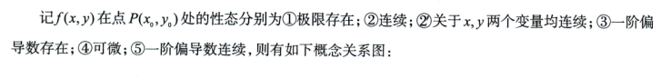
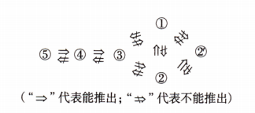

# 第13讲 多元函数微分学（第2课）

> [!abstract] 研究二元函数的性质
> 在指定点判定连续、单变量连续、偏导数存在或可微时，先看题目要求的是任意路径、坐标轴方向，还是全增量的一阶线性近似，再使用相应定义。

## 一、连续与单变量连续

### 1. 判定二元函数在一点连续

**O：** 判断 $f(x,y)$ 在 $(x_0,y_0)$ 是否连续。

**P：** 求二重极限并与函数值比较：

$$
\lim_{(x,y)\to(x_0,y_0)}f(x,y)=f(x_0,y_0).
$$

**D：** 二重极限要求定义域内任意趋近路径结果相同；沿两条路径所得极限不同，就可判不连续。不能用累次极限代替二重极限。

### 2. 判定单变量连续

**O：** 判断在 $(x_0,y_0)$ 处“关于 $x$ 连续”或“关于 $y$ 连续”。

**P：** 固定另一个变量，分别按一元函数的连续性判断：

$$
\lim_{x\to x_0}f(x,y_0)=f(x_0,y_0),\qquad
\lim_{y\to y_0}f(x_0,y)=f(x_0,y_0).
$$

**D：** 二元连续推出关于两个变量都连续；反过来，即使两个单变量方向都连续，也不能推出二元连续。

> [!example] 对应例题
> [[AI课程总结/强化篇/高数/第13讲 多元函数微分学/例题#例 13.7 两个单变量方向连续但二元不连续|例 13.7]]

## 二、偏导数的存在性

### 1. 用定义判断一点的偏导数

**O：** 判断 $f'_x(x_0,y_0)$、$f'_y(x_0,y_0)$ 是否存在，尤其是分段点或公式失效点。

**P：** 固定另一变量，计算一元差商：

$$
f'_x(x_0,y_0)=\lim_{\Delta x\to0}\frac{f(x_0+\Delta x,y_0)-f(x_0,y_0)}{\Delta x},
\qquad
f'_y(x_0,y_0)=\lim_{\Delta y\to0}\frac{f(x_0,y_0+\Delta y)-f(x_0,y_0)}{\Delta y}.
$$

**D：** 偏导数只检查过该点且平行于坐标轴的方向；两个一阶偏导数都存在，也不能推出二元连续或可微。连续也不能推出偏导数存在。偏导数存在则对应的单变量方向连续。

> [!example] 对应例题
> [[AI课程总结/强化篇/高数/第13讲 多元函数微分学/例题#例 13.8 不连续但两个偏导数存在|例 13.8]]；[[AI课程总结/强化篇/高数/第13讲 多元函数微分学/例题#例 13.9 连续但偏导数不存在|例 13.9]]

## 三、全微分与可微性 #必考 #重要 #2021/6

### 1. 按“全增量—线性增量—余项”判可微

**O：** 判断 $z=f(x,y)$ 在 $(x_0,y_0)$ 是否可微，或求该点全微分。

**P：** 依次计算：

1. 全增量 $\Delta z=f(x_0+\Delta x,y_0+\Delta y)-f(x_0,y_0)$，并记 $\rho=\sqrt{(\Delta x)^2+(\Delta y)^2}$。
2. 若该点两个偏导数存在，写线性增量 $dz=f'_x(x_0,y_0)\Delta x+f'_y(x_0,y_0)\Delta y$。
3. 检验 $\displaystyle\lim_{\rho\to0}\frac{\Delta z-dz}{\rho}=0$。成立即 $\Delta z=dz+o(\rho)$，该点**可微**；否则不可微。

**D：** $\rho\to0$ 是 $(\Delta x,\Delta y)\to(0,0)$ 的二重趋近；只验坐标轴或一条路径不能证明余项极限为 $0$，但找到一条合法路径使比值不趋于 $0$，即可否定可微。**可微**时 $dz=f'_x(x_0,y_0)\,dx+f'_y(x_0,y_0)\,dy$。

### 2. 用偏导数连续性判可微

**O：** 题目给出一阶偏导数在点附近存在且在该点连续。

**P：** 直接判该点可微。

**D：** “一阶偏导数在该点连续”是充分条件；可微不能反推一阶偏导数连续。仅有该点两个偏导数存在，也不能代替连续性条件。

## 四、概念关系与判题顺序

### 1. 必然成立的推论 #熟记 

在相应定义与邻域条件下：

$$
\text{一阶偏导数在该点连续}
\Longrightarrow\text{可微}
\Longrightarrow\text{连续}
\Longrightarrow\text{二重极限存在},
$$

$$
\text{可微}\Longrightarrow\text{两个一阶偏导数存在}
\Longrightarrow\text{关于两个变量分别连续}.
$$

二元连续也推出关于两个变量分别连续。上述箭头一般不能反向使用；二元连续与两个偏导数存在互不推出，二重极限存在与两个单变量方向连续也互不推出。

> [!attention] 
> 求一点的导数时，要使用导数的定义

### 2. 同时判断多种性质

**O：** 选择题同时问连续、偏导数存在、可微等性质。

**P：** 先画可用的单向箭头；对不能由箭头推出的性质分别验证：连续查二重极限，偏导查两个差商，可微查余项极限。

**D：** 不连续可直接推出不可微；但不连续仍可能有两个偏导数。连续而偏导数不存在时也不可微。不要凭选项形式猜答案。
