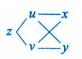
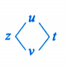

# 第13讲 多元函数微分学（第4课）

> [!abstract] 计算偏导数、全微分
> 显式复合结构用链式求导；方程约束用隐函数求导；求隐函数的全微分时，还可直接对等式两侧取全微分。

## 一、链式求导规则

### 1. 按复合路径逐条求导

**O：** 已知 $z=f(u,v)$，其中 $u=u(x,y)$、$v=v(x,y)$，求 $z$ 对 $x$、$y$ 的偏导数；或已知 $u=u(t)$、$v=v(t)$，求 $dz/dt$。

**P：** 每条从 $z$ 到目标变量的路径贡献一项；同一路径上的导数相乘，不同路径相加：

$$
\frac{\partial z}{\partial x}=f_1(u,v)u_x+f_2(u,v)v_x,=\frac{\partial z}{\partial u}\cdot\frac{\partial u}{\partial x}+\frac{\partial z}{\partial v}\cdot\frac{\partial v}{\partial x}\qquad
$$
$$
\frac{\partial z}{\partial y}=f_1(u,v)u_y+f_2(u,v)v_y=\frac{\partial z}{\partial u} \cdot \frac{\partial u}{\partial y} + \frac{\partial z}{\partial v} \cdot \frac{\partial v}{\partial y};
$$

$$
\frac{dz}{dt}=f_1(u,v)\frac{du}{dt}+f_2(u,v)\frac{dv}{dt}.
$$

**D：** 若 $u$ 只依赖 $x$，其导数写 $du/dx$；若同时依赖 $x,y$，写 $\partial u/\partial x$。最终 $z$ 只依赖一个变量 $t$ 时，左侧写全导数 $dz/dt$。同名函数嵌套时，始终保留每一层的自变量，例如 $f_1(x+y,f(x,y))$ 与 $f_1(x,y)$ 不可混写。二阶偏导数须先对一阶结果再次逐路径求导，并使用乘积法则。

> [!example] 对应例题
> [[AI课程总结/强化篇/高数/第13讲 多元函数微分学/例题#例 13.16 同名函数嵌套求混合偏导|例 13.16]]

## 二、隐函数求导法

### 1. 一个方程确定 $z=z(x,y)$

**O：** $F(x,y,z)=0$ 确定二元隐函数 $z=z(x,y)$，求 $z_x,z_y$。

**P：** 若 $P_0=(x_0,y_0,z_0)$ 满足 $F(P_0)=0$、$F_z(P_0)\ne0$，则在该点附近可用

$$
\frac{\partial z}{\partial x}=-\frac{F'_x}{F'_z},\qquad \frac{\partial z}{\partial y}=-\frac{F'_y}{F'_z}.
$$

先把所有变量视为**独立字母**求 $F_x,F_y,F_z$，再代入满足方程的目标点。

> [!warning] 公式法三铁律
> 1. ** $x, y, z$ 全部独立**: 用公式法时, $x, y, z$ 三个字母**互不依赖**,**谁也不是谁的函数**。
> 2. **谁当常数一目了然**: 对 $x$ 求偏导 → $y, z$ 当常数;对 $z$ 求偏导 → $x, y$ 当常数。
> 3. **不要"代入"复合关系**: 比如 $F$ 里出现 $xy$,别想着"$\frac{\partial (xy)}{\partial x} = y + x \cdot \frac{\partial y}{\partial x}$" —— 在公式法里, $y$ **就是常数**, $xy$ 对 $x$ 求导**就是 $y$ **。

**D：** 公式前的负号和分母 $F_z$ 不可漏；求点处值前先确定该点属于给定方程，且 $F_z\ne0$。使用局部隐函数结论还需相应邻域内的连续偏导条件。

### 2. 两个方程确定 $y=y(x),z=z(x)$

**O：** 方程组 $F(x,y,z)=0,\ G(x,y,z)=0$ 确定 $y,z$ 为 $x$ 的函数，求 $dy/dx$ 或 $dz/dx$。

**P：** 记

$$
J=\frac{\partial(F,G)}{\partial(y,z)}=
\begin{vmatrix}F'_y&F'_z\\G'_y&G'_z\end{vmatrix}.
$$

在方程组成立、偏导连续且 $J\ne0$ 的点附近，

$$
\frac{dy}{dx}=-\frac{\partial(F,G)/\partial(x,z)}{J},\qquad
\frac{dz}{dx}=-\frac{\partial(F,G)/\partial(y,x)}{J}.
$$

**D：** 雅可比行列式的行按 $F,G$ 排，列按分母的变量顺序排；$\partial(F,G)/\partial(y,x)$ 的第二列是对 $x$ 求导，不能擅自换成 $\partial(F,G)/\partial(x,y)$ 而不改符号。代数值前先解出对应点，并检查 $J\ne0$。

> [!example] 对应例题
> [[AI课程总结/强化篇/高数/第13讲 多元函数微分学/例题#例 13.17 方程组求隐函数导数|例 13.17]]

## 三、全微分形式不变性

### 1. 对隐式等式两侧取全微分

**O：** $z=z(x,y)$ 由含 $x,y,z$ 的等式确定，目标是全微分 $dz$。

**P：** 对等式两侧逐项取全微分，把 $dx,dy,dz$ 收集后解出 $dz$。例如对于 $w=f(u,v)$，无论 $u,v$ 是自变量还是中间变量，只要相应可微，都有

$$
dw=f_u\,du+f_v\,dv.
$$

也可整理为 $F(x,y,z)=0$，直接写 $F_x\,dx+F_y\,dy+F_z\,dz=0$。

**D：** 分式、对数等先检查定义域；解 $dz$ 时其系数必须非零。所得结果还可写成 $dz=z_x\,dx+z_y\,dy$，与隐函数公式互相核对。

> [!example] 对应例题
> [[AI课程总结/强化篇/高数/第13讲 多元函数微分学/例题#例 13.15 全微分形式不变性求隐函数微分|例 13.15]]

## 四、全微分公式大观

### 1. 由标准形式识别原函数

**O：** 给出 $P(x,y)\,dx+Q(x,y)\,dy$，需要识别它是哪一函数的全微分，或据此凑微分。

**P：** 先认基本式，再认对数、比值、反正切的复合结构。以下各式只在右侧函数有定义且可微的区域使用：

$$
\begin{aligned}
x\,dx+y\,dy&=d\!\left(\frac{x^2+y^2}{2}\right),&
x\,dx-y\,dy&=d\!\left(\frac{x^2-y^2}{2}\right),\\
y\,dx+x\,dy&=d(xy),&
\frac{y\,dx+x\,dy}{xy}&=d\ln\lvert xy\rvert,\\
\frac{x\,dx+y\,dy}{x^2+y^2}&=d\!\left[\frac12\ln(x^2+y^2)\right],&
\frac{x\,dx-y\,dy}{x^2-y^2}&=d\!\left[\frac12\ln\lvert x^2-y^2\rvert\right],\\
\frac{x\,dy-y\,dx}{x^2}&=d\!\left(\frac yx\right),&
\frac{y\,dx-x\,dy}{y^2}&=d\!\left(\frac xy\right),\\
\frac{y\,dx-x\,dy}{x^2+y^2}&=d\!\left(\arctan\frac xy\right),&
\frac{x\,dy-y\,dx}{x^2+y^2}&=d\!\left(\arctan\frac yx\right),\\
\frac{y\,dx-x\,dy}{x^2-y^2}&=d\!\left[\frac12\ln\left\lvert\frac{x-y}{x+y}\right\rvert\right],&
\frac{x\,dy-y\,dx}{x^2-y^2}&=d\!\left[\frac12\ln\left\lvert\frac{x+y}{x-y}\right\rvert\right],\\
\frac{x\,dx+y\,dy}{(x^2+y^2)^2}&=d\!\left(-\frac1{2(x^2+y^2)}\right),&
\frac{x\,dx-y\,dy}{(x^2-y^2)^2}&=d\!\left(-\frac1{2(x^2-y^2)}\right),\\
\frac{x\,dx+y\,dy}{1+(x^2+y^2)^2}&=d\!\left[\frac12\arctan(x^2+y^2)\right],&
\frac{x\,dx-y\,dy}{1+(x^2-y^2)^2}&=d\!\left[\frac12\arctan(x^2-y^2)\right].
\end{aligned}
$$

**D：** 每式只在自身分母非零的区域使用；含 $\arctan(x/y)$ 的式子须 $y\ne0$，含 $\arctan(y/x)$ 的式子须 $x\ne0$。若已知 $P\,dx+Q\,dy=du$ 且相关二阶偏导连续，则 $P=u_x,Q=u_y$，可用 $P_y=Q_x$ 求参数；单凭该等式不能在任意区域断定全微分存在。数学一中，$\operatorname{grad}u=(P,Q)$。

## 五、$k$ 次齐次函数与欧拉等式

### 1. 先作同步伸缩，再化简偏导组合

**O：** 求 $x f_x+y f_y$，且 $f(tx,ty)$ 能提取统一的 $t$ 次幂；或需判断函数是否为 $k$ 次齐次函数。

**P：** 在允许的 $t>0$ 上检验 $f(tx,ty)=t^k f(x,y)$，由此直接写

$$
xf_x+yf_y=kf(x,y).
$$

若已知右侧等式，要反推齐次性，可沿固定射线考察 $f(tx,ty)/t^k$ 对 $t$ 的导数是否为零。

**D：** 教材的充要条件以一阶连续偏导数为前提；反向推导还要在同一条正向伸缩射线上始终处于定义域内。含 $y/x$ 的函数先排除 $x=0$，含 $\ln(y/x)$ 还须 $y/x>0$；不能对不在定义域内的 $t$ 使用伸缩等式。

> [!example] 对应例题
> [[AI课程总结/强化篇/高数/第13讲 多元函数微分学/例题#例 13.18 齐次函数的欧拉等式|例 13.18]] · [[AI课程总结/强化篇/高数/第13讲 多元函数微分学/例题#例 13.19 零次齐次函数|例 13.19]] · [[AI课程总结/强化篇/高数/第13讲 多元函数微分学/例题#例 13.20 二次齐次函数反求单变量函数|例 13.20]]
