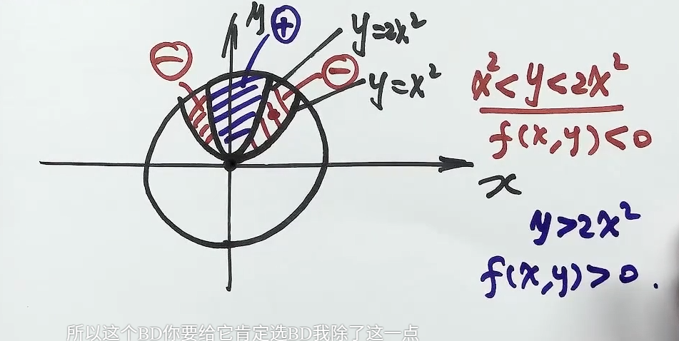

# 第13讲 多元函数微分学（第6课）

> [!abstract] 求多元函数的极值、最值
> 无条件极值先找可疑点再判别，条件极值构造拉格朗日函数，闭区域最值收集内部与边界候选点后统一比较。

## 一、无条件极值

### 1. 求二元显函数、隐函数的极值

**O：** 求二元显函数 $z=f(x,y)$ 或二元隐函数 $z=z(x,y)$ 的极值。

**P：**

1. 求一阶偏导数，解 $f'_x=f'_y=0$，得到驻点 $P_i$；补查函数有定义但偏导数不存在的点。
2. 在各驻点处计算
   $$
   A=f''_{xx}(P_i),\qquad B=f''_{xy}(P_i),\qquad C=f''_{yy}(P_i),\qquad \Delta=AC-B^2.
   $$
3. 用下表判别；确定极值点后，代回原函数求极值。

| 条件 | 结论 |
| --- | --- |
| $\Delta>0$，$A<0$ | 极大值 |
| $\Delta>0$，$A>0$ | 极小值 |
| $\Delta<0$ | 不是极值点 |
| $\Delta=0$ | 判别法失效，回到定义 |

> [!tip] 开不开心少年团
> [多元函数的极值与最值](AI课程总结/基础篇/高数/第13讲/多元函数的极值与最值.md#4%20必背记忆法%20开不开心少年团%20🎯)

**D：** 判别表要求驻点的某邻域内有二阶连续偏导数。$\Delta>0$ 时 $A,C$ 必同号且非零。驻点只是必要条件；偏导数不存在的点不能直接套此表。隐函数先确认所研究的分支及隐函数求导条件，再计算偏导数。一阶偏导为零不代表二阶偏导为零。

**记忆：** “大鼻子爷爷”对应 $\Delta=0$、方法失效；“小哑巴猪”对应 $\Delta<0$、不是极值；$\Delta>0$ 再看 $A$，$A>0$ 为极小，$A<0$ 为极大。

> [!example] 对应例题
> [[AI课程总结/强化篇/高数/第13讲 多元函数微分学/例题#例 13.25 驻点与判别式|例 13.25]]

### 2. 判别式为**零**时用定义与特殊路径

**O：** $\Delta=0$，需要继续判定极值性。

**P：** 研究 $f(x,y)-f(x_0,y_0)$ 在目标点附近的符号：先看坐标轴、$y=kx$ 等特殊路径；若仍不能否定，观察因式分解后的零值曲线与不同区域。

- 证明极小值：须在某个完整邻域内恒有 $f(x,y)\ge f(x_0,y_0)$；极大值反向。
- 否定极值：须能在任意小邻域内找到函数值大于、又小于目标值的点；可用两条趋近路径或两类区域实现。

**D：** 一条路径上的较小值只能否定极小值，不能同时否定极大值。即使每条固定直线上的一元函数都在目标点取极小值，也不能推出二元函数有极小值；各路径允许的邻域可能依赖路径参数。含参数时先检查最低次项系数是否为零，再讨论主导项。

> [!example] 对应例题
> [[AI课程总结/强化篇/高数/第13讲 多元函数微分学/例题#例 13.26 所有直线路径取极小仍非二元极值|例 13.26]]

### 3. 结合闭区域连续函数性质的概念题

**O：** 函数在平面有界闭区域 $D$ 上连续，结合偏导数条件判断最值点位于内部还是边界。

**P：**

1. 用[最值定理](1-3.%20一元函数微分学/3.%20应用/2.%20中值定理、微分等式与微分不等式/中值定理.md#1%20有界与最值定理)确认最大值、最小值存在。
2. 若最值在内部取得，该点必为无条件极值点；偏导存在时还必为驻点。
3. 将给定二阶偏导数条件化成 $A,B,C,\Delta$ 的关系；若所有内部驻点均有 $\Delta<0$，排除内部最值，最值只能在边界上取得。

**D：** 有界性与闭性缺一不可。只排除部分驻点不能排除整个内部；必须覆盖所有内部候选点。

> [!example] 对应例题
> [[AI课程总结/强化篇/高数/第13讲 多元函数微分学/例题#例 13.27 最值只能在边界取得|例 13.27]]

### 4. 抽象函数的极值充分条件

**O：** 给出 $z=f(x)f(y)$ 等结构，要求某点取得极大值或极小值的充分条件。

**P：** 先验证该点为驻点，再按乘积结构求二阶偏导数，把题干条件代入 $A,B,C$；将选项与“$\Delta>0$ 且 $A<0$”或“$\Delta>0$ 且 $A>0$”比较。

> [!tip] 
> 使用题目条件判断出 $\Delta$ 的正负，得到区域内是否存在极值

**D：** 正确的充分条件只须能推出所需结论，不必刻画所有情形。一般判别表需二阶偏导连续；若只给一元函数二阶可导，可由该点二阶展开直接核实乘积函数的极值性。

> [!example] 对应例题
> [[AI课程总结/强化篇/高数/第13讲 多元函数微分学/例题#例 13.28 乘积型抽象函数的极大值|例 13.28]]

### 5. 多元极值与最值的区别

**多元函数的唯一极值点不一定是最值点**；可以只有多个极大值而没有极小值，也可以只有多个极小值而没有极大值。不能把一元连续函数在区间上的极值分布结论直接搬到多元函数上。

> [!note] 对于**一元**函数
> 1. 唯一极值必为最值
> 2. 若有两个极值点，必是一极大值，一极小值

## 二、条件极（最）值与拉格朗日乘数法

### 1. 构造辅助函数并解方程组

**O：** 求目标函数 $u=f(x,y,z)$ 在 $\varphi(x,y,z)=0$、$\psi(x,y,z)=0$ 下的最值。

**P：**

1. 构造
   $$
   F(x,y,z,\lambda,\mu)=f(x,y,z)+\lambda\varphi(x,y,z)+\mu\psi(x,y,z).
   $$
2. 将 $x,y,z,\lambda,\mu$ 视为独立变量，联立
   $$
   F'_x=F'_y=F'_z=F'_\lambda=F'_\mu=0.
   $$
   其中后两式就是原约束。
3. 解出所有可行候选点，代入原目标函数比较函数值。
4. 确认最值存在且候选点完整，才能把比较结果确认为最大值、最小值。

**D：** 一个约束添一个乘数；辅助函数的自变量个数等于目标函数自变量个数加约束个数。通常要求约束可微且约束梯度线性无关；不满足此条件的可行点要另查。拉格朗日方程给的是必要条件，解出点不自动成为极值点。若可行域不闭、不有界，须另证最值存在。

### 2. 解方程组前先观察结构

**O：** 拉格朗日方程组直接消元较繁琐，或目标函数含根号、绝对值、乘积。

**P：**

- 消元是基本方法；先观察有无特殊解及轮换对称性，除以变量前保留变量为零的分支。
- 若约束能方便地代入目标函数消去一个变量，先降为一元最值问题。
- 对目标函数作严格单调变换，简化求导：

| 原目标 | 可改求的目标 | 使用条件与还原 |
| --- | --- | --- |
| $\sqrt u$ | $u$ | $u\ge0$；最值点相同，最后开方 |
| $\lvert u\rvert$ | $u^2$ | 等同于 $\sqrt{u^2}$；最后开方，不能直接改求 $u$ |
| $u_1u_2$ | $\ln u_1+\ln u_2$ | $u_1,u_2>0$；最值点相同，最后还原乘积值 |

**D：** 对称性用于发现和整理分支，不能只凭对称便认定所有解满足变量相等。取对数要检查正性；降元后须保留完整的变量范围与端点。

### 3. 利用齐次函数化简候选值

**O：** 约束中出现 $k$ 次齐次函数，方程组含 $f'_x,f'_y$，目标涉及 $x^2+y^2$ 等组合。

**P：** 调用欧拉等式

$$
xf'_x+yf'_y=kf(x,y).
$$

把两个驻点方程分别乘 $x,y$ 后相加，利用约束值将目标函数值改写成乘数的表达式；再求乘数。若关于 $x,y$ 的方程是齐次线性方程组，且已确认 $(x,y)\ne(0,0)$，令系数行列式为零求乘数。

**D：** 齐次关系须在定义域内成立；行列式为零后仍要核对相应分支能满足约束，最后还原原目标函数。

> [!example] 对应例题
> [[AI课程总结/强化篇/高数/第13讲 多元函数微分学/例题#例 13.30 齐次约束与距离最值|例 13.30]]

### 4. 用行列式写条件极值的必要关系

**O：** 已知条件极值点，要求判断目标函数偏导数之间的关系。

**P：** 二元函数 $f$ 在 $g=0$ 下的正则条件极值点 $P_0$ 满足

$$
\left.\begin{vmatrix}f'_x&f'_y\\g'_x&g'_y\end{vmatrix}\right|_{P_0}=0,
\qquad f'_x(P_0)g'_y(P_0)=f'_y(P_0)g'_x(P_0).
$$

三元函数在两个约束下，可写

$$
\left.\begin{vmatrix}
f'_x&f'_y&f'_z\\
\varphi'_x&\varphi'_y&\varphi'_z\\
\psi'_x&\psi'_y&\psi'_z
\end{vmatrix}\right|_{P_0}=0.
$$

**D：** 这是必要关系，不能反推极值。二元情况需约束梯度非零；三元情况在约束梯度线性无关时由乘数方程推出，若两梯度相关则该行列式本身为零。等式中出现乘积为零，不能任意指定哪个因子为零；约分前检查非零条件。

> [!example] 对应例题
> [[AI课程总结/强化篇/高数/第13讲 多元函数微分学/例题#例 13.29 条件极值的偏导关系|例 13.29]]

### 5. 最值转化为不等式与含参讨论

**O：** 在约束下证明不等式，或求参数使某不等式恒成立。

**P：** 求可行域上的最小值 $m$、最大值 $M$，得到 $m\le f\le M$；再把目标不等式转成对 $m,M$ 的要求。参数会改变候选点或判别式时，按临界值分段。

**D：** 等号条件对应实际达到最值的可行点；不能把未达到的上、下确界直接称为最大值、最小值。

## 三、闭区域上的最值

### 1. 内部与边界分别找点后统一比较

**O：** 求连续函数 $f(x,y)$ 在有界闭区域 $D$ 上的最大值和最小值。

**P：**

1. **内部：** 解 $f'_x=f'_y=0$，仅保留 $D$ 内部的驻点，补查偏导不存在但函数有定义的点。
2. **边界：** 对每段边界用拉格朗日乘数法，或代入边界方程消元，求该段上的候选点；补查端点、角点及约束不正则的点。
3. 比较所有候选点的函数值，最大者为最大值，最小者为最小值。

**D：** 内部候选点无须用 $\Delta$ 判别；非极值驻点也可以先保留参与比较。闭区域上的最值不能只查内部，也不能只查边界。边界降为一元问题后，区间端点不能遗漏。

> [!example] 对应例题
> [[AI课程总结/强化篇/高数/第13讲 多元函数微分学/例题#例 13.31 圆盘上的最大值与最小值|例 13.31]]

## 四、考场自查

- [ ] 先区分无条件极值、条件极值和闭区域最值。
- [ ] $\Delta$ 用 $AC-B^2$；$\Delta=0$ 不能直接断定非极值。
- [ ] 特殊路径可否定极值，所有固定直线路径同向也不足以肯定二元极值。
- [ ] 乘数作为独立变量；约束、零分支与定义域均保留。
- [ ] 最值存在性、内部点、边界点及降元后的端点已核对。
- [ ] 化简目标后，答案已还原为原目标函数的值。
