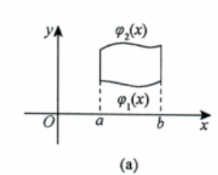
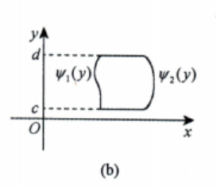

# 第14讲 二重积分（第2课）

> [!abstract] 常用结论与计算法
> 先看被积函数和区域，再决定用直角坐标、极坐标，或先换元简化区域；定限与面积元必须随坐标一起改变。

## 一、单位圆域的常用结论 #熟记 

**O：** 积分区域为单位圆域 $D=\{(x,y):x^2+y^2\leq1\}$，被积函数与下列形式相同。

**P：** 可直接调用：

$$
\begin{aligned}
\iint_D(x^2+y^2)\,\mathrm d\sigma&=\frac{\pi}{2},&
\iint_D\sqrt{x^2+y^2}\,\mathrm d\sigma&=\frac{2\pi}{3},\\
\iint_D\sqrt{1-(x^2+y^2)}\,\mathrm d\sigma&=\frac{2\pi}{3},&
\iint_D\bigl(1-\sqrt{x^2+y^2}\bigr)\,\mathrm d\sigma&=\frac{\pi}{3},\\
\iint_D\left(\frac{x^2}{a^2}+\frac{y^2}{b^2}\right)\mathrm d\sigma
&=\frac{\pi}{4}\left(\frac1{a^2}+\frac1{b^2}\right),a b\ne0.
\end{aligned}
$$

**D：** 第三式的根号是 $\sqrt{1-(x^2+y^2)}$；第五式的区域仍是**单位圆域**，$a,b$ 只出现在被积函数中。

## 二、直角坐标系：按区域类型定限

### 1. $X$ 型区域（上下型）

**O：** 区域可写成 $D=\{(x,y):a\leq x\leq b,\ \varphi_1(x)\leq y\leq\varphi_2(x)\}$。

**P：** 先把 $x$ 固定，在区域内画竖线；沿线从下边界积到上边界：

$$
\iint_D f(x,y)\,\mathrm d\sigma
=\int_a^b\!\mathrm dx\int_{\varphi_1(x)}^{\varphi_2(x)}f(x,y)\,\mathrm dy.
$$

**D：** 对每个 $x\in[a,b]$ 都须有 $\varphi_1(x)\leq\varphi_2(x)$；若一条竖线与区域相交为几段，应先分区。

### 2. $Y$ 型区域（左右型）

**O：** 区域可写成 $D=\{(x,y):c\leq y\leq d,\ \psi_1(y)\leq x\leq\psi_2(y)\}$。

**P：** 先把 $y$ 固定，在区域内画横线；沿线从左边界积到右边界：

$$
\iint_D f(x,y)\,\mathrm d\sigma
=\int_c^d\!\mathrm dy\int_{\psi_1(y)}^{\psi_2(y)}f(x,y)\,\mathrm dx.
$$

**D：** 对每个 $y\in[c,d]$ 都须有 $\psi_1(y)\leq\psi_2(y)$。换积分次序时先固定同一个区域，再重新找投影与内层上下限。

### 3. 坐标形式与被积函数不匹配

**O：** 区域以极坐标给出，而被积函数在直角坐标中更容易积分。

**P：** 把 $r=\text{常数}$、$\theta=\text{常数}$ 或 $r=\sec\theta$ 等边界分别转成直角坐标曲线，画出 $D$，再按 $X$ 型或 $Y$ 型区域定限。

**D：** 换系后应使用与新变量匹配的面积元；内层再作一元换元时，同时换被积函数、积分限和微分。

> [!example] 配套例题
> [[AI课程总结/强化篇/高数/第14讲 二重积分/例题#例 14.6 极坐标区域改用直角坐标计算|例 14.6]]

## 三、极坐标系：先选系，再沿射线定限

**O：** 被积函数含 $f(x^2+y^2)$、$f(y/x)$、$f(x/y)$ 等形式，或积分区域为圆或圆的一部分；也可比较两种坐标下的区域边界与计算量。

**P：** 令 $x=r\cos\theta$、$y=r\sin\theta$，则 $x^2+y^2=r^2$、$y/x=\tan\theta$（$x\ne0$）、$x/y=\cot\theta$（$y\ne0$），且 $\mathrm d\sigma=r\,\mathrm dr\,\mathrm d\theta$。先定角度范围，再固定 $\theta$ 画射线，从近端到远端写半径限：

$$
\iint_D f(x,y)\,\mathrm d\sigma
=\int_\alpha^\beta\!\mathrm d\theta
\int_{r_1(\theta)}^{r_2(\theta)}
f(r\cos\theta,r\sin\theta)\,r\,\mathrm dr.
$$

**D：** 极点在区域外时，内半径通常不为 $0$；极点在边界上时，可从 $r=0$ 积到外边界；极点在区域内且每条射线一次穿过区域时，可取 $0\leq\theta\leq2\pi$、$0\leq r\leq r(\theta)$。若射线的交段发生变化，分角度区间处理。始终写出面积元中的 $r$，并检查 $0\leq r_1(\theta)\leq r_2(\theta)$。

> [!example] 配套例题
> [[AI课程总结/强化篇/高数/第14讲 二重积分/例题#例 14.7 非标准椭圆边界的极坐标积分|例 14.7]]

## 四、二重积分换元法

**O：** 原坐标下被积函数、区域边界或积分限复杂，改用新变量后更简单。

**P：** 设 $x=x(u,v)$、$y=y(u,v)$，依次完成三换：

1. 被积函数：$f(x,y)\to f(x(u,v),y(u,v))$。
2. 积分区域：$D_{xy}\to D_{uv}$，重新写新变量的范围。
3. 面积元：$\mathrm dx\,\mathrm dy\to\left|\dfrac{\partial(x,y)}{\partial(u,v)}\right|\mathrm du\,\mathrm dv$。

于是

$$
\iint_{D_{xy}}f(x,y)\,\mathrm dx\,\mathrm dy
=\iint_{D_{uv}}f(x(u,v),y(u,v))
\left|\frac{\partial(x,y)}{\partial(u,v)}\right|\mathrm du\,\mathrm dv,
$$

其中

$$
\frac{\partial(x,y)}{\partial(u,v)}
=\begin{vmatrix}
\dfrac{\partial x}{\partial u}&\dfrac{\partial x}{\partial v}\\
\dfrac{\partial y}{\partial u}&\dfrac{\partial y}{\partial v}
\end{vmatrix}.
$$

**D：** 在适用的区域内，变换应为一一对应、具有连续偏导，且雅可比行列式非零；面积元乘的是**行列式的绝对值**。行列式自身的两道竖线表示行列式，不代替外层绝对值。极坐标变换的雅可比为 $r$，故面积元含 $r$。

### 偏心圆先平移

**O：** 区域含 $(x-a)^2+(y-b)^2\leq R^2$，原点极坐标下半径限或积分式繁杂。

**P：** 先设 $u=x-a$、$v=y-b$，把圆心移到新原点；平移的雅可比绝对值为 $1$。再把区域中的直线条件和被积函数都改写为 $u,v$，必要时对新圆域用极坐标。

**D：** 平移后不能沿用旧坐标下的象限判断；角度区间须由**新区域**决定。特别是 $v\geq u$ 包含整整一个半圆，不只第一象限的一块。

> [!example] 配套例题与辅助理解
> [[AI课程总结/强化篇/高数/第14讲 二重积分/例题#辅助例 3 平移与伸缩的面积元|平移与伸缩]] · [[AI课程总结/强化篇/高数/第14讲 二重积分/例题#例 14.8 偏心圆平移换元|例 14.8]]

## 五、考场自查

- [ ] 直角坐标的内层限，是否沿竖线从下到上、沿横线从左到右？
- [ ] 极坐标是否先定角度，再写非负的内外半径，并补上面积元 $r$？
- [ ] 换元时被积函数、区域、面积元是否全换，雅可比是否取绝对值？
- [ ] 偏心圆平移后，是否重新判断直线条件覆盖的角度范围？
