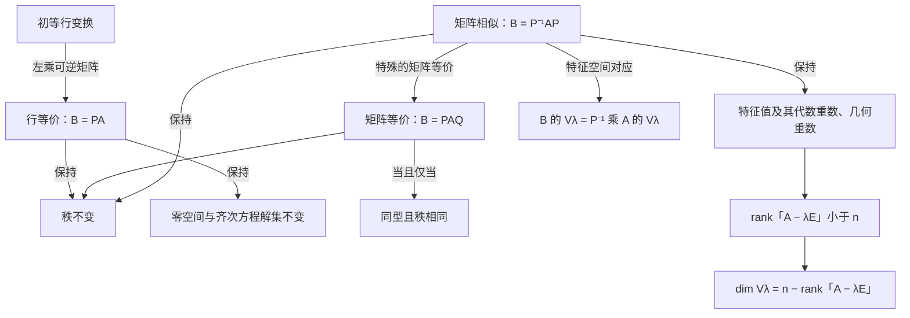

# 矩阵相似、等价、初等行变换、秩与特征向量的关系

> [!abstract] 一句话总览
> **初等行变换**是操作，主要保持方程组与秩；**矩阵等价**允许左右分别乘可逆矩阵，只保留线性映射的**秩**；**矩阵相似**要求左右变换互为逆矩阵，表示同一线性变换在不同基下的矩阵，因此还能保留**特征值**和特征空间结构。特征向量问题最终统一为研究 $A-\lambda E$ 的秩与零空间。

## 一、五个概念分别在说什么

| 概念 | 数学表达 | 限制 | 核心含义 | 主要不变量 |
| --- | --- | --- | --- | --- |
| 初等行变换 | $B=PA$，$P$ 可逆 | $A,B$ 同型 | 对方程作可逆的消元操作 | 秩、行空间、齐次方程解集 |
| 行等价 | $B=PA$，$P$ 可逆 | $A,B$ 同型 | 可由有限次初等行变换互相得到 | 秩、行空间、零空间 |
| 矩阵等价 | $B=PAQ$，$P,Q$ 可逆 | $A,B$ 同型，可为长方阵 | 定义域、值域分别换基 | 秩 |
| 矩阵相似 | $B=P^{-1}AP$，$P$ 可逆 | 只能讨论同阶方阵 | 同一线性变换在不同基下的表示 | 秩、行列式、迹、特征值、特征多项式、最小多项式、可对角化性 |
| 特征向量 | $A\boldsymbol{x}=\lambda\boldsymbol{x}$，$\boldsymbol{x}\ne\boldsymbol{0}$ | 只能讨论方阵 | 经过变换后方向不变的非零向量 | 由 $A-\lambda E$ 的零空间决定 |

其中，“同型”指矩阵的行数、列数分别相同。

## 二、初等行变换与矩阵的秩

每进行一次初等行变换，都等价于在矩阵左侧乘一个可逆的初等矩阵。因此有限次初等行变换可统一写成

$$
B=PA,
$$

其中 $P$ 可逆。

于是

$$
r(B)=r(PA)=r(A).
$$

所以，**初等行变换不改变矩阵的秩**。把矩阵化为行阶梯形矩阵后，非零行数就是矩阵的秩。

### 对方程组的影响

若 $B=PA$，则对齐次方程有

$$
A\boldsymbol{x}=\boldsymbol{0}
\iff PA\boldsymbol{x}=\boldsymbol{0}
\iff B\boldsymbol{x}=\boldsymbol{0}.
$$

因此，初等行变换不仅保持秩，还保持齐次方程的全部解，即

$$
N(A)=N(B).
$$

对非齐次方程必须对增广矩阵 $(A,\boldsymbol{b})$ 整体作同样的行变换，才能保证方程组同解。

> [!warning] 行变换一般不保持特征值
> 对 $A$ 作行变换得到 $B=PA$，通常不是相似变换，因此 $A$ 与 $B$ 的特征值、特征向量一般会改变。例如对 $E_2$ 交换两行得到
> $$
> B=\begin{pmatrix}0&1\\1&0\end{pmatrix}.
> $$
> $E_2$ 的特征值全为 $1$，而 $B$ 的特征值为 $1,-1$。

## 三、矩阵等价与秩：等价分类只看秩

若同型矩阵 $A,B$ 满足

$$
B=PAQ,
$$

其中 $P,Q$ 均可逆，则称 $A$ 与 $B$ 等价。

- 左乘可逆矩阵 $P$：对应有限次初等**行**变换；
- 右乘可逆矩阵 $Q$：对应有限次初等**列**变换。

因此，矩阵等价就是可以通过有限次初等行、列变换互相得到。

对任意 $m\times n$ 矩阵 $A$，均可通过初等变换化为秩标准形

$$
A\sim
\begin{pmatrix}
E_r&0\\
0&0
\end{pmatrix},
\qquad r=r(A).
$$

故同型矩阵满足

$$
\boxed{A\text{ 与 }B\text{ 等价}\iff r(A)=r(B).}
$$

> [!important] 注意“行等价”比“矩阵等价”更强
> 仅有 $r(A)=r(B)$，只能保证可通过行、列变换实现矩阵等价，不能保证仅用行变换就能把 $A$ 化为 $B$。同型矩阵行等价的本质条件是它们具有相同的行空间。

## 四、矩阵相似与矩阵等价

若存在可逆矩阵 $P$，使

$$
B=P^{-1}AP,
$$

则称方阵 $A$ 与 $B$ 相似。

相似式也是等价式的特殊情形：令左矩阵为 $P^{-1}$、右矩阵为 $P$，便有

$$
\boxed{A\text{ 与 }B\text{ 相似}\Longrightarrow A\text{ 与 }B\text{ 等价}
\Longrightarrow r(A)=r(B).}
$$

反向一般不成立。

### 为什么相似比等价强

- 等价变换 $B=PAQ$ 中，左右两个可逆矩阵可以独立选择，只保留线性映射的秩。
- 相似变换 $B=P^{-1}AP$ 中，左右矩阵必须互为逆矩阵，表示在定义域和值域中使用同一次换基，因此保留更多结构。

### 反例：等价未必相似

令

$$
A=\begin{pmatrix}1&0\\0&0\end{pmatrix},
\qquad
B=\begin{pmatrix}2&0\\0&0\end{pmatrix}.
$$

二者的秩都为 $1$，所以等价；但特征值分别为 $1,0$ 与 $2,0$，故不相似。

即使两个矩阵的秩和特征值都相同，也未必相似。例如

$$
E_2,
\qquad
J=\begin{pmatrix}1&1\\0&1\end{pmatrix}
$$

都有秩 $2$，特征值也都是 $1,1$，但 $E_2$ 可对角化而 $J$ 不可对角化，所以二者不相似。

## 五、相似矩阵与特征向量的对应关系

设

$$
B=P^{-1}AP.
$$

若 $A$ 的特征向量 $\boldsymbol{x}$ 对应特征值 $\lambda$，即

$$
A\boldsymbol{x}=\lambda\boldsymbol{x},
$$

则

$$
B(P^{-1}\boldsymbol{x})
=P^{-1}AP(P^{-1}\boldsymbol{x})
=P^{-1}A\boldsymbol{x}
=\lambda(P^{-1}\boldsymbol{x}).
$$

因此 $P^{-1}\boldsymbol{x}$ 是 $B$ 对应于同一特征值 $\lambda$ 的特征向量。

若记特征空间为

$$
V_\lambda(A)=\{\boldsymbol{x}\mid A\boldsymbol{x}=\lambda\boldsymbol{x}\},
$$

则

$$
\boxed{V_\lambda(B)=P^{-1}V_\lambda(A).}
$$

所以相似矩阵的特征向量通常不是同一组向量，但其特征空间由可逆映射一一对应，维数相同。

## 六、秩与特征值、特征向量的统一桥梁

特征方程

$$
A\boldsymbol{x}=\lambda\boldsymbol{x}
$$

等价于齐次方程

$$
(A-\lambda E)\boldsymbol{x}=\boldsymbol{0}.
$$

要存在非零解，系数矩阵必须不满秩。因此对 $n$ 阶方阵，

$$
\boxed{\lambda\text{ 是 }A\text{ 的特征值}
\iff r(A-\lambda E)<n
\iff |A-\lambda E|=0.}
$$

对应特征空间的维数为

$$
\boxed{\dim V_\lambda(A)=n-r(A-\lambda E).}
$$

这就是“秩”与“特征向量个数”的直接联系：$A-\lambda E$ 的秩越小，其零空间维数越大，对应线性无关特征向量就越多。

### 特别地：零特征值与 $r(A)$

取 $\lambda=0$，得到

$$
\boxed{0\text{ 是 }A\text{ 的特征值}\iff r(A)<n\iff |A|=0.}
$$

而零特征值对应的特征空间就是 $A$ 的零空间：

$$
V_0(A)=N(A),
\qquad
\dim V_0(A)=n-r(A).
$$

因此，初等行变换虽然通常改变非零特征值及其特征向量，但由于它保持 $N(A)$，所以对方阵而言会保持零特征值对应的特征向量集合。

## 七、关系图

> [!note] 图中最关键的单向关系
> 相似一定等价，等价一定同秩；但同秩不一定相似，同特征值也不一定相似。

## 八、考研常见判断结论

| 命题 | 正误 | 理由 |
| --- | --- | --- |
| 初等行变换不改变矩阵的秩 | 对 | 左乘可逆矩阵不改变秩 |
| 初等行变换不改变矩阵的特征值 | 错 | 行变换一般不是相似变换 |
| 同型矩阵秩相同，则二者等价 | 对 | 可化为同一个秩标准形 |
| 等价矩阵一定相似 | 错 | 等价只要求秩相同，相似还要保持特征结构 |
| 相似矩阵一定等价 | 对 | $P^{-1}AP$ 是 $PAQ$ 的特殊形式 |
| 相似矩阵有相同的特征值 | 对 | 特征多项式相同 |
| 特征值相同的矩阵一定相似 | 错 | 还要看特征空间、Jordan 结构等 |
| 相似矩阵有完全相同的特征向量 | 错 | 特征向量按 $\boldsymbol{x}\mapsto P^{-1}\boldsymbol{x}$ 对应 |
| $r(A)<n$ 等价于 $0$ 是 $A$ 的特征值 | 对 | 仅对 $n$ 阶方阵成立 |
| $r(A)=r(B)$ 能推出二者特征值相同 | 错 | 秩只直接反映零特征值相关信息 |

## 九、做题时的判断顺序

1. **先看矩阵是否为方阵。** 长方阵只能谈等价、秩，不能谈相似和特征值。
2. **看到初等行变换，先想到秩与方程同解。** 不要擅自推出特征值不变。
3. **看到矩阵等价，核心只抓秩。** 对同型矩阵，等价与同秩互推。
4. **看到矩阵相似，想到“同一线性变换换基”。** 可推出秩、行列式、迹、特征多项式、特征值及可对角化性相同。
5. **求特征向量时，转成齐次方程。** 解 $(A-\lambda E)\boldsymbol{x}=\boldsymbol{0}$。
6. **问特征空间维数时，直接用**
   $$
   \dim V_\lambda(A)=n-r(A-\lambda E).
   $$
7. **问零特征值时，直接联系 $r(A)$。** $r(A)<n$ 才存在零特征值，其几何重数为 $n-r(A)$。

## 十、最终速记

> [!summary]
> - **行变换：** $B=PA$，保秩、保齐次方程解，不保一般特征值。
> - **等价：** $B=PAQ$，同型矩阵“等价 $\iff$ 同秩”。
> - **相似：** $B=P^{-1}AP$，是特殊的等价，保留特征结构。
> - **特征向量：** $(A-\lambda E)\boldsymbol{x}=0$ 的非零解。
> - **秩与特征空间：** $\dim V_\lambda(A)=n-r(A-\lambda E)$。
> - **逻辑链：** 相似 $\Rightarrow$ 等价 $\Rightarrow$ 同秩；反向均不成立。
